# VeighNa 架构图示详解

> **可视化项目结构与调用逻辑**

## 📊 目录

1. [整体架构图](#整体架构图)
2. [核心组件交互图](#核心组件交互图)
3. [事件处理流程图](#事件处理流程图)
4. [数据流动图](#数据流动图)
5. [AI Alpha模块架构](#ai-alpha模块架构)
6. [网关系统架构](#网关系统架构)
7. [应用模块架构](#应用模块架构)

---

## 整体架构图

### 🏗️ 系统分层架构

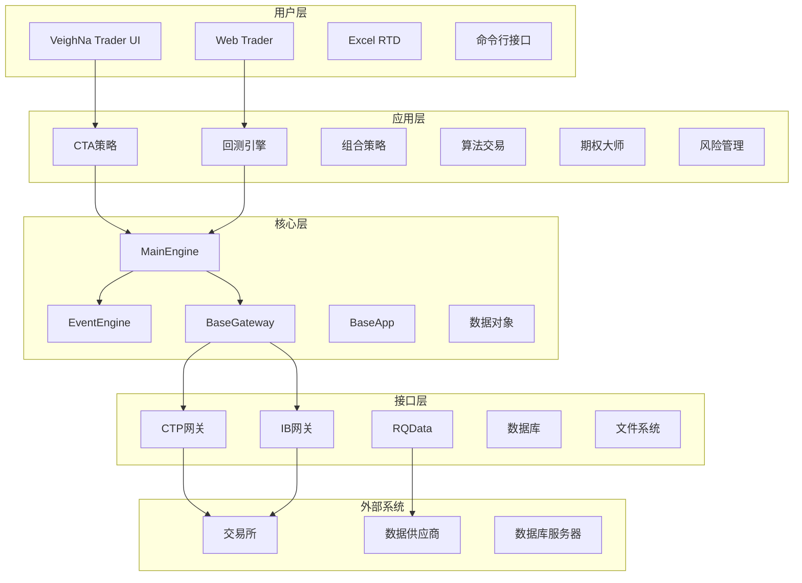

### 🔄 运行时架构

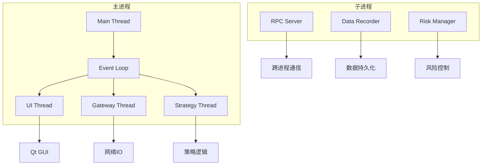

---

## 核心组件交互图

### 🏗️ MainEngine 组件关系

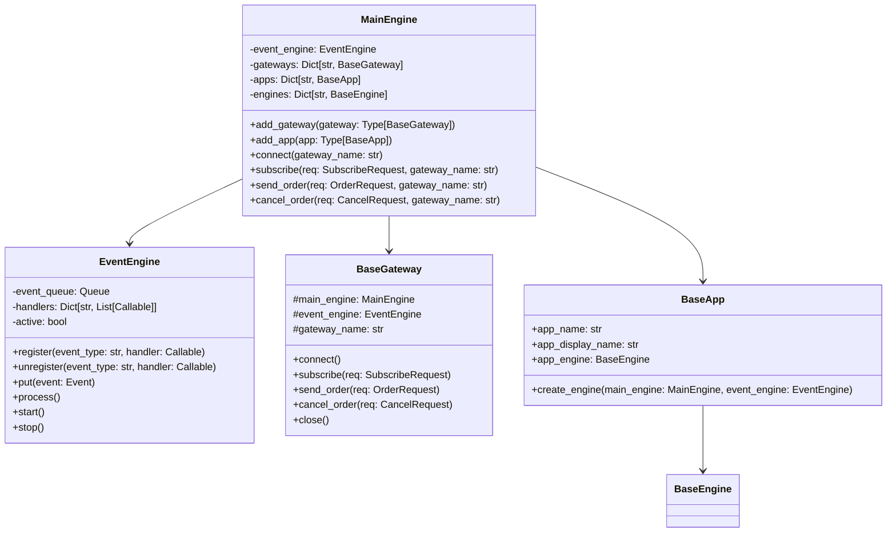

### 🔄 事件处理机制

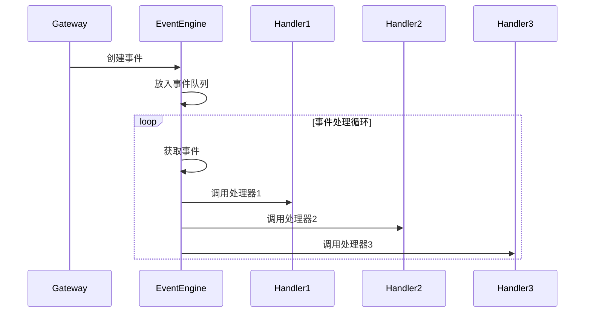

---

## 事件处理流程图

### 📡 行情数据处理流程

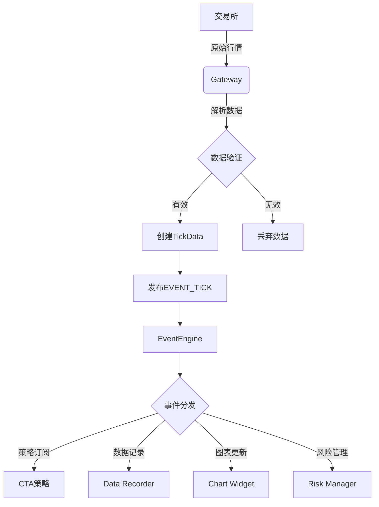

### 📤 订单处理流程

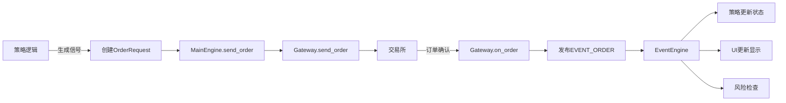

### 💰 成交处理流程

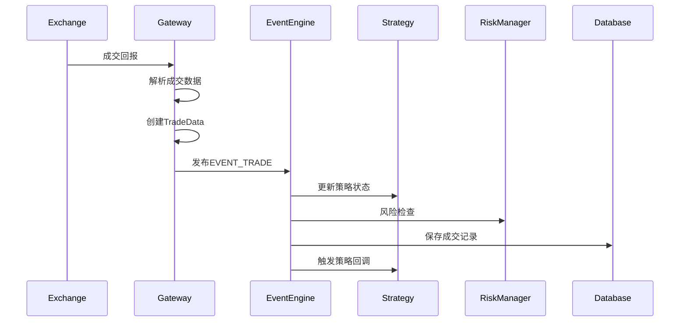

---

## 数据流动图

### 🔄 完整数据流

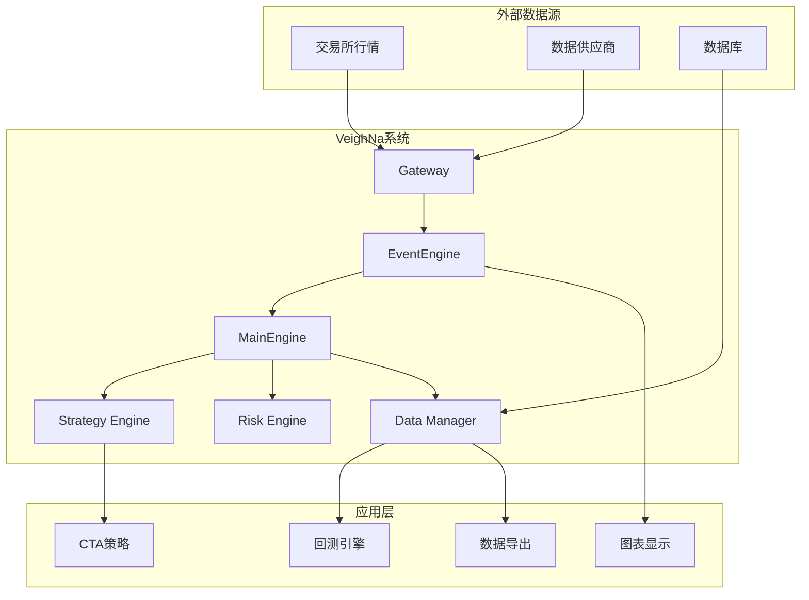

### 📊 数据存储架构

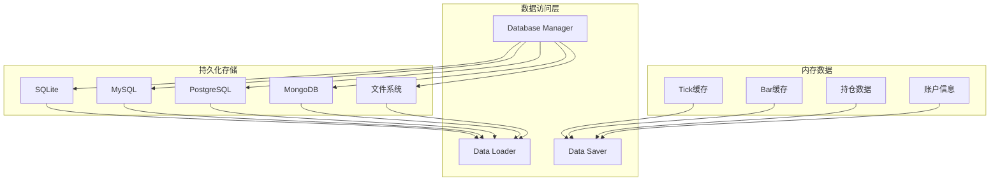

---

## AI Alpha模块架构

### 🧠 Alpha研究实验室架构

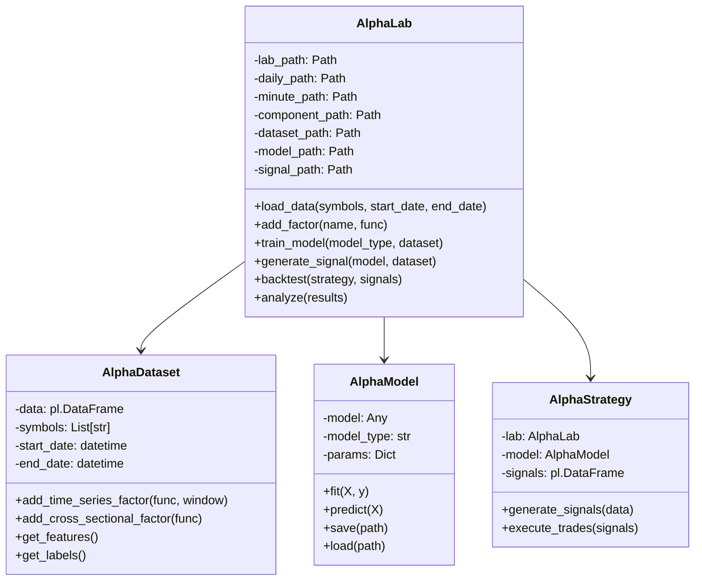

### 📊 因子计算流程

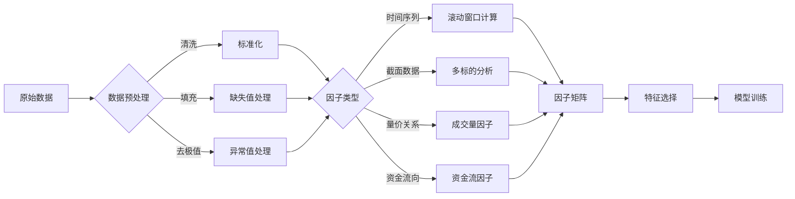

### 🤖 模型训练流程

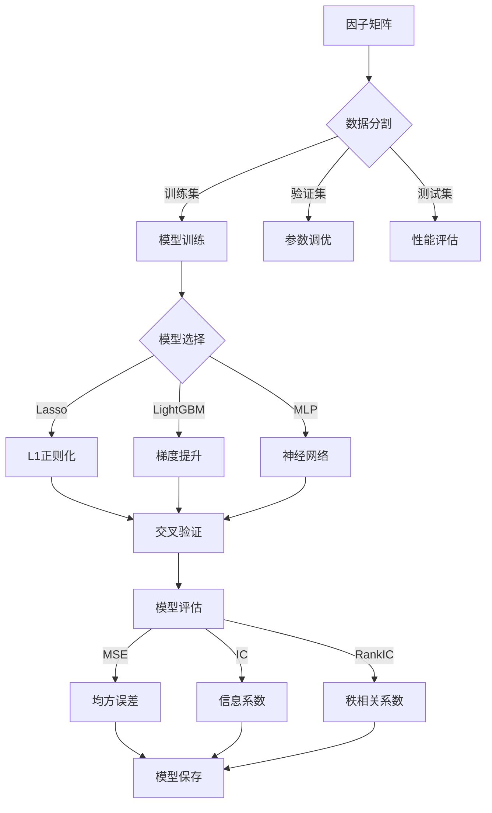

---

## 网关系统架构

### 🌐 网关接口架构

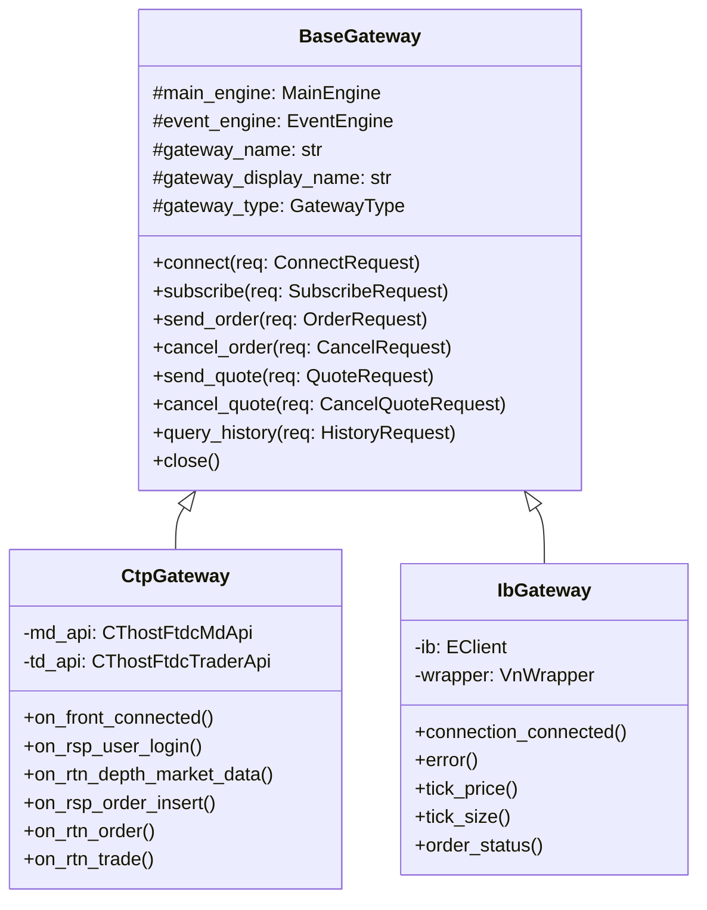

### 🔄 网关通信流程

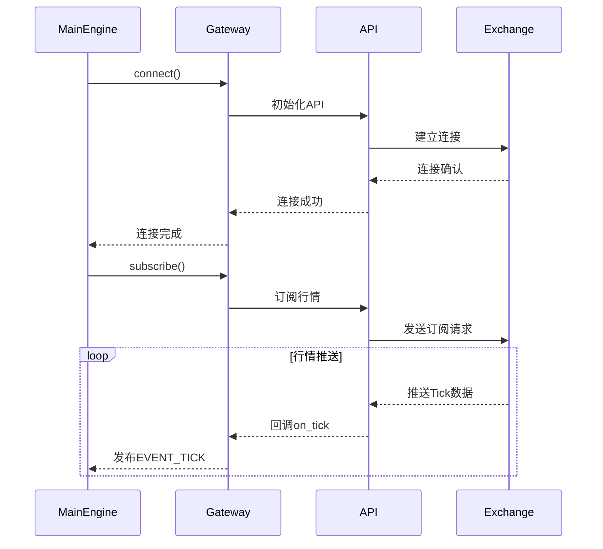

---

## 应用模块架构

### 🏛️ 应用模块关系

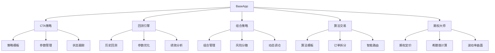

### 📈 CTA策略引擎

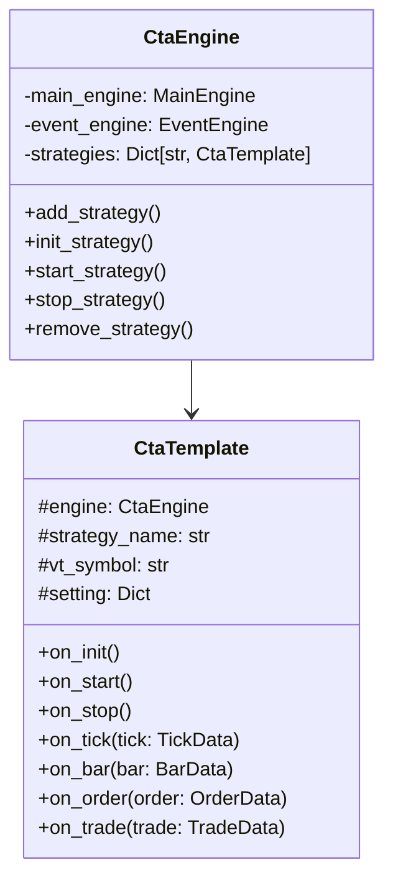

### 🔄 策略执行流程

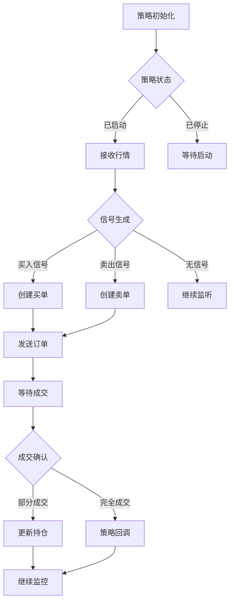

---

## 总结

通过这些架构图，我们可以清晰地看到VeighNa框架的：

1. **模块化设计**: 各组件职责明确，易于扩展
2. **事件驱动**: 高效处理实时数据流
3. **分层架构**: 用户界面、业务逻辑、数据访问分离
4. **插件系统**: 支持多种交易接口和应用模块
5. **AI集成**: 完整的机器学习研究到交易的工作流

这些图表为理解和使用VeighNa框架提供了直观的视觉指导。🚀