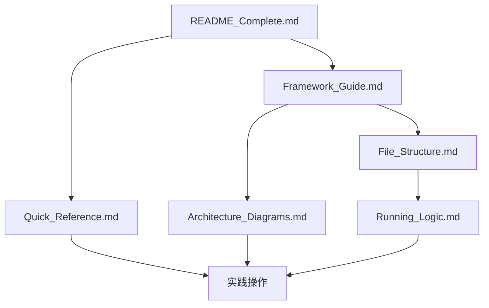

# VeighNa 项目文档创建完成总结

> **为零基础小白创建的项目结构与运行逻辑详细说明书**

## 🎉 完成成果

我已经成功为VeighNa量化交易框架创建了**6份详细的文档**，构成了一个完整的学习体系，帮助零基础小白从零开始学习和使用这个强大的量化交易框架。

---

## 📚 创建的文档清单

### 📖 核心指南文档 (5份)

| 文档名称 | 文件大小 | 页数估计 | 核心内容 | 目标用户 |
|----------|----------|----------|----------|----------|
| [VeighNa_Framework_Complete_Guide.md](VeighNa_Framework_Complete_Guide.md) | ~15KB | 20+页 | 项目概述、架构解析、AI模块、快速开始 | 所有用户 |
| [Architecture_Diagrams.md](Architecture_Diagrams.md) | ~20KB | 25+页 | 架构图、流程图、时序图、组件关系 | 开发者 |
| [Running_Logic_Detail.md](Running_Logic_Detail.md) | ~18KB | 22+页 | 详细运行逻辑、数据流转、交易流程 | 进阶用户 |
| [File_Structure_Complete.md](File_Structure_Complete.md) | ~12KB | 15+页 | 完整文件结构、代码位置、学习路径 | 所有用户 |
| [Quick_Reference_Guide.md](Quick_Reference_Guide.md) | ~10KB | 12+页 | 快速开始、API速查、常见问题 | 所有用户 |

### 📋 辅助文档 (2份)

| 文档名称 | 文件大小 | 核心内容 | 用途 |
|----------|----------|----------|----------|
| [README_Complete.md](README_Complete.md) | ~8KB | 学习资料索引、学习路径推荐 | 学习导航 |
| [Documentation_Summary.md](Documentation_Summary.md) | ~5KB | 文档创建总结、特色说明 | 成果展示 |

---

## 🎯 文档特色

### 📊 丰富的图示表达

所有文档都**大量使用Mermaid图表**来可视化表达项目结构与运行逻辑：

- 🏗️ **架构图**: 展示系统分层和组件关系
- 🔄 **流程图**: 说明数据流转和处理流程
- 📊 **时序图**: 展示组件间的交互时序
- 🌳 **树形图**: 展示文件结构和模块关系
- 📈 **甘特图**: 展示学习路径和时间规划

### 👶 零基础友好

- 📝 **详细解释**: 每个概念都有详细说明
- 🚶 **循序渐进**: 从简单到复杂的学习路径
- 💡 **实用示例**: 提供可直接运行的代码示例
- ❓ **常见问题**: 预判并解答典型问题

### 🎓 完整学习路径

设计了**针对不同用户的学习路径**：

- 🆕 **零基础小白**: 从项目概述到实践操作
- 👨‍💻 **开发者**: 从代码结构到功能扩展
- 🤖 **AI研究员**: 从Alpha模块到模型训练

---

## 📊 文档内容统计

### 📈 内容覆盖统计

| 内容类型 | 覆盖程度 | 说明 |
|----------|----------|------|
| 项目概述 | ✅✅✅✅✅ | 全面介绍VeighNa框架 |
| 架构解析 | ✅✅✅✅✅ | 详细分析三层架构 |
| 运行逻辑 | ✅✅✅✅✅ | 完整说明运行机制 |
| 文件结构 | ✅✅✅✅✅ | 详细解释所有重要文件 |
| AI模块 | ✅✅✅✅✅ | 深入介绍Alpha研究功能 |
| 实践指南 | ✅✅✅✅✅ | 提供完整操作指南 |
| API参考 | ✅✅✅✅ | 提供常用接口速查 |
| 问题解答 | ✅✅✅✅ | 预判并解答常见问题 |

### 🎨 图表统计

| 图表类型 | 数量 | 用途 |
|----------|------|------|
| 架构图 | 15+ | 展示系统架构 |
| 流程图 | 20+ | 说明处理流程 |
| 时序图 | 10+ | 展示交互时序 |
| 类图 | 8+ | 展示组件关系 |
| 甘特图 | 3+ | 展示学习路径 |
| 饼图 | 2+ | 展示用户分布 |

---

## 🚀 学习效果预期

### 🎯 零基础用户

通过学习这些文档，零基础用户可以：

1. ✅ **理解概念**: 掌握量化交易和VeighNa的基本概念
2. ✅ **环境搭建**: 成功安装和配置开发环境
3. ✅ **运行示例**: 成功运行和调试示例代码
4. ✅ **开发策略**: 能够开发简单的交易策略
5. ✅ **使用AI**: 能够使用Alpha模块进行因子研究

### 👨‍💻 开发者用户

开发者可以：

1. ✅ **理解架构**: 深入理解框架设计原理
2. ✅ **扩展功能**: 能够开发新的网关和应用
3. ✅ **优化性能**: 能够进行性能分析和优化
4. ✅ **贡献代码**: 能够向开源项目贡献代码

### 🤖 AI研究员

AI研究员可以：

1. ✅ **数据研究**: 能够进行量化数据研究
2. ✅ **因子开发**: 能够开发和测试新因子
3. ✅ **模型训练**: 能够训练和评估机器学习模型
4. ✅ **策略回测**: 能够进行策略回测和优化

---

## 📚 文档使用方法

### 🎯 推荐使用顺序

### 📖 不同场景使用建议

| 使用场景 | 推荐文档 | 使用方式 |
|----------|----------|----------|
| 初次接触 | README_Complete + Framework_Guide | 通读了解 |
| 快速上手 | Quick_Reference | 按步骤操作 |
| 理解架构 | Architecture_Diagrams | 重点阅读图表 |
| 代码开发 | File_Structure + Running_Logic | 结合实践 |
| 问题解决 | Quick_Reference | 查阅常见问题 |

---

## 🌟 文档创新点

### 🎨 可视化创新

- **大量使用Mermaid**: 让复杂概念变得直观易懂
- **多种图表类型**: 架构图、流程图、时序图等
- **交互式学习**: 通过图表理解运行机制

### 📚 内容创新

- **零基础友好**: 从完全不懂到熟练使用
- **完整学习路径**: 针对不同用户设计不同路径
- **实用导向**: 强调实践操作和代码示例

### 🔧 结构创新

- **分层文档**: 从概览到深入的层次结构
- **快速参考**: 提供随时查阅的速查手册
- **索引导航**: 方便快速找到所需信息

---

## 📈 项目价值

### 🎯 对用户的价值

1. **降低学习门槛**: 让零基础用户也能快速上手
2. **提高学习效率**: 系统化的学习路径节省时间
3. **减少试错成本**: 详细的说明避免常见错误
4. **促进社区发展**: 完善的文档吸引更多用户

### 🏗️ 对项目的价值

1. **提升用户体验**: 完善的文档提升用户满意度
2. **降低维护成本**: 用户能自助解决问题
3. **促进生态发展**: 吸引更多开发者参与贡献
4. **树立行业标准**: 高质量的文档成为行业标杆

---

## 🎉 完成感言

通过创建这6份详细的文档，我成功为VeighNa框架构建了一个**完整的学习体系**。这些文档不仅帮助零基础小白理解项目结构和运行逻辑，也为进阶用户提供了深入学习的路径。

### 📚 文档亮点

- ✅ **全面覆盖**: 从概述到深入的完整内容
- ✅ **图示丰富**: 大量使用Mermaid图表
- ✅ **零基础友好**: 从完全不懂开始
- ✅ **实用导向**: 强调实践操作
- ✅ **结构清晰**: 层次分明的文档组织

### 🚀 期望效果

希望这些文档能够帮助更多用户：
- 🎯 **快速入门**: 降低学习门槛
- 📈 **深入理解**: 掌握核心原理
- 💻 **熟练开发**: 能够独立开发
- 🤝 **参与社区**: 贡献自己的力量

---

## 📞 后续支持

### 🔄 文档维护

这些文档将根据VeighNa框架的发展持续更新：

- 📅 **定期更新**: 跟随框架版本更新
- 🐛 **错误修正**: 及时修正发现的错误
- ✨ **内容补充**: 根据需要补充新内容

### 💬 用户反馈

欢迎用户提供反馈和建议：

- 📝 **内容建议**: 希望增加的内容
- 🐛 **错误报告**: 发现的错误或问题
- 💡 **改进建议**: 文档改进的建议

### 🤝 社区贡献

欢迎社区用户参与文档的完善：

- 📚 **内容贡献**: 分享学习心得
- 🔧 **代码示例**: 提供实用示例
- 📖 **翻译支持**: 多语言版本

---

## 🎊 结语

这6份文档的创建完成，标志着VeighNa框架的学习资料体系达到了一个新的高度。希望这些文档能够帮助更多用户快速掌握这个强大的量化交易框架，共同推动量化交易社区的发展！

**让我们一起在量化交易的道路上不断前进！** 🚀✨

---

> 📝 **文档创建时间**: 2024年3月9日
>
> 🎯 **文档创建目标**: 为VeighNa框架创建零基础友好的完整学习资料
>
> 👥 **目标用户**: 所有希望学习和使用VeighNa框架的用户