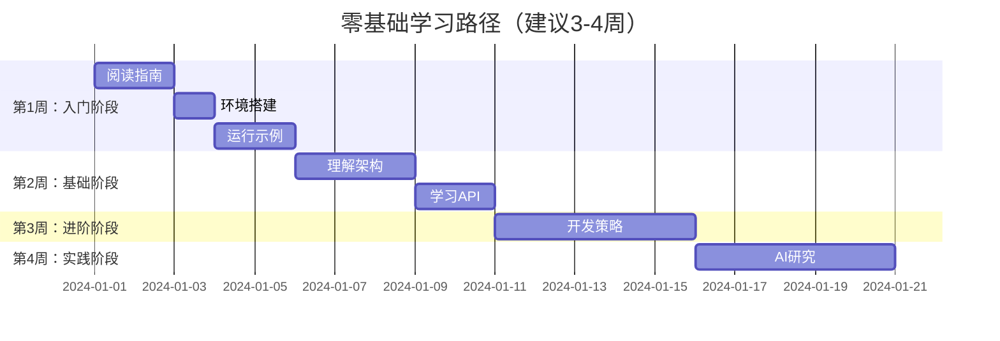
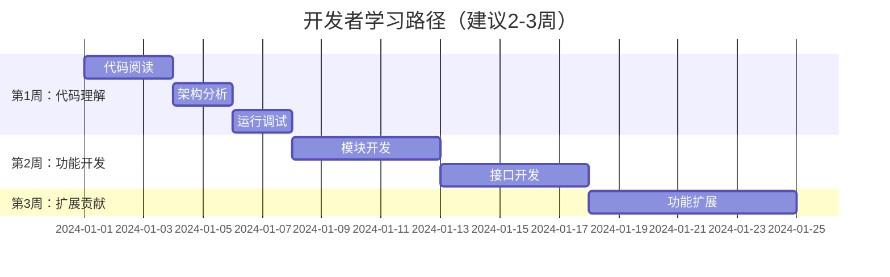
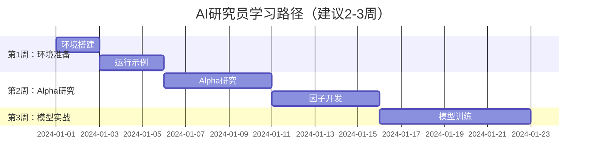

# VeighNa 学习资料包

> **零基础到精通的完整学习指南**

## 🎉 欢迎来到VeighNa学习世界！

我为你创建了一套**完整的VeighNa学习资料**，帮助你从零基础小白成长为VeighNa专家！这套资料包含6份详细文档，从不同角度全面解析VeighNa框架。

---

## 📚 学习资料清单

### 🌟 核心学习文档

#### 📖 1. [VeighNa_Framework_Complete_Guide.md](VeighNa_Framework_Complete_Guide.md)
**🎯 项目完整指南** | **适合：所有用户** | **⭐ 推荐阅读顺序：第1本**

- 🏗️ 项目概述和核心功能特点
- 📊 三层架构设计详解
- 🤖 AI Alpha模块完整介绍
- 🚀 快速开始指南
- 📈 丰富的架构图和流程图

#### 📖 2. [File_Structure_Complete.md](File_Structure_Complete.md)
**🎯 文件结构详解** | **适合：所有用户** | **⭐ 推荐阅读顺序：第2本**

- 📁 完整的项目文件结构
- 🏗️ 核心包和模块详解
- 📊 重要文件功能说明
- 🎓 学习路径建议
- 📚 代码位置导航

#### 📖 3. [Architecture_Diagrams.md](Architecture_Diagrams.md)
**🎯 架构图示详解** | **适合：开发者** | **⭐ 推荐阅读顺序：第3本**

- 🏗️ 系统分层架构图
- 🔄 核心组件交互图
- 📊 事件处理流程图
- 🌐 网关系统架构
- 🧠 AI模块架构图

#### 📖 4. [Running_Logic_Detail.md](Running_Logic_Detail.md)
**🎯 运行逻辑详解** | **适合：进阶用户** | **⭐ 推荐阅读顺序：第4本**

- 🚀 系统启动流程详解
- 🔄 事件处理机制深入分析
- 📊 数据流转过程完整说明
- 🎯 交易执行流程详细解析
- 🤖 AI Alpha工作流程

#### 💎 5. [Quick_Reference_Guide.md](Quick_Reference_Guide.md)
**🎯 快速参考指南** | **适合：所有用户** | **💎 随时查阅**

- 🚀 5分钟快速开始
- 📝 常用命令速查表
- 🎯 核心概念解释
- 💻 API接口速查
- ❓ 常见问题解答

### 📋 辅助文档

#### 📖 6. [README_Complete.md](README_Complete.md)
**🎯 学习资料索引** | **适合：所有用户** | **📚 学习导航**

- 🎓 完整的学习路径推荐
- 📊 资料内容对比分析
- 🎯 快速导航指南
- 📚 额外学习资源

---

## 🎓 学习路径推荐

### 🆕 零基础小白路径



**📚 推荐阅读顺序：**
1. 📖 `VeighNa_Framework_Complete_Guide.md` (了解全貌)
2. 💎 `Quick_Reference_Guide.md` (快速开始)
3. 📁 `File_Structure_Complete.md` (理解结构)
4. 🏗️ `Architecture_Diagrams.md` (深入架构)
5. 🔄 `Running_Logic_Detail.md` (掌握原理)

### 👨‍💻 开发者路径



**📚 推荐阅读顺序：**
1. 📁 `File_Structure_Complete.md` (代码导航)
2. 🏗️ `Architecture_Diagrams.md` (架构分析)
3. 🔄 `Running_Logic_Detail.md` (运行原理)
4. 📖 `VeighNa_Framework_Complete_Guide.md` (功能参考)
5. 💎 `Quick_Reference_Guide.md` (API速查)

### 🤖 AI研究员路径



**📚 推荐阅读顺序：**
1. 💎 `Quick_Reference_Guide.md` (快速开始)
2. 📖 `VeighNa_Framework_Complete_Guide.md` (AI模块)
3. 🔄 `Running_Logic_Detail.md` (Alpha工作流程)
4. 📊 实践 `examples/alpha_research/` 示例

---

## 🎯 快速开始

### 🚀 5分钟体验

```bash
# 1. 安装VeighNa
pip install -e .[alpha,dev]

# 2. 运行示例
python examples/veighna_trader/run.py

# 3. 查看文档
# 打开 VeighNa_Framework_Complete_Guide.md
```

### 📖 第一天学习计划

1. **上午** (2小时)
   - 📖 阅读 `Quick_Reference_Guide.md` 的"快速开始"
   - 🚀 成功运行示例程序

2. **下午** (3小时)
   - 📖 阅读 `VeighNa_Framework_Complete_Guide.md` 的前两章
   - 📁 浏览 `File_Structure_Complete.md`

---

## 📊 学习资料特色

### 🎨 丰富的图示

所有文档都**大量使用Mermaid图表**：

- 🏗️ **架构图**: 直观展示系统结构
- 🔄 **流程图**: 清晰说明处理流程
- 📊 **时序图**: 展示组件交互时序
- 🌳 **树形图**: 展示文件结构关系

### 👶 零基础友好

- 📝 **详细解释**: 每个概念都有详细说明
- 🚶 **循序渐进**: 从简单到复杂的学习路径
- 💡 **实用示例**: 提供可直接运行的代码
- ❓ **常见问题**: 预判并解答典型问题

### 🎯 完整覆盖

| 学习内容 | 覆盖文档 | 覆盖程度 |
|----------|----------|----------|
| 项目概述 | Framework Guide | ✅✅✅✅✅ |
| 架构解析 | Architecture Diagrams | ✅✅✅✅✅ |
| 运行逻辑 | Running Logic Detail | ✅✅✅✅✅ |
| 文件结构 | File Structure Complete | ✅✅✅✅✅ |
| 快速参考 | Quick Reference Guide | ✅✅✅✅✅ |
| AI模块 | 所有文档 | ✅✅✅✅✅ |

---

## 📚 学习建议

### 🎯 通用建议

1. **理论与实践结合**
   - 📖 阅读文档的同时运行示例代码
   - 💻 动手修改参数观察效果
   - 🔍 遇到问题及时查阅文档

2. **循序渐进**
   - 🆕 零基础用户按推荐路径学习
   - 👨‍💻 开发者重点关注架构和代码
   - 🤖 AI研究员重点学习Alpha模块

3. **多查多问**
   - 💎 随时查阅 `Quick_Reference_Guide.md`
   - 📚 善用 `README_Complete.md` 导航
   - 💬 遇到问题到社区寻求帮助

### 🎓 进阶建议

1. **深入理解**
   - 🏗️ 研究架构设计原理
   - 🔄 理解事件驱动机制
   - 📊 分析数据流转过程

2. **动手实践**
   - 💻 开发简单的交易策略
   - 🧪 进行策略回测
   - 🤖 尝试因子研究和模型训练

3. **参与社区**
   - 💬 在论坛分享经验
   - 🤝 帮助其他用户
   - 🛠️ 贡献代码和文档

---

## 📞 获取帮助

### 📚 自助资源

1. **📖 学习资料**
   - 仔细阅读本学习资料包
   - 按照推荐路径系统学习

2. **💻 示例代码**
   - 运行 `examples/` 目录下的示例
   - 修改参数观察效果

3. **📚 官方文档**
   - [VeighNa官方文档](https://www.vnpy.com/docs/cn/index.html)
   - [GitHub仓库](https://github.com/vnpy/vnpy)

### 👥 社区支持

1. **💬 社区论坛**
   - [VeighNa论坛](https://www.vnpy.com/forum/)
   - 提问前搜索是否已有答案

2. **📱 微信群**
   - 扫描项目README中的二维码
   - 与社区成员实时交流

3. **🐧 QQ群**
   - 群号: 262656087
   - 定期清理潜水成员

---

## 🎁 额外资源

### 📊 示例代码

```bash
examples/
├── alpha_research/           # Alpha研究示例
│   ├── download_data_rq.ipynb      # RQData下载
│   ├── research_workflow_lgb.ipynb  # LGB研究工作流
│   └── research_workflow_mlp.ipynb  # MLP研究工作流
├── veighna_trader/          # 交易界面示例
│   └── run.py
└── client_server/           # RPC通信示例
    ├── run_client.py
    └── run_server.py
```

### 🧪 测试文件

```bash
tests/
├── test_alpha101.py         # Alpha101因子测试
├── test_event_engine.py     # 事件引擎测试
└── test_gateway.py          # 网关测试
```

### 🛠️ 开发工具

```bash
# 代码检查
ruff check .

# 类型检查
mypy vnpy

# 运行测试
python -m pytest tests/ -v
```

---

## 🎉 开始你的VeighNa之旅！

现在你已经拥有了**完整的VeighNa学习资料**，可以按照推荐的学习路径开始你的量化交易之旅了！

### 🎯 学习提醒

- 📖 **耐心学习**: 量化交易是复杂领域，需要时间积累
- 💻 **多实践**: 理论结合实践才能快速进步
- 🤝 **多交流**: 社区是你最好的学习伙伴
- 🎯 **保持热情**: 持续学习，不断进步

### 🚀 预祝成功

祝你：
- 🎯 **快速掌握** VeighNa框架
- 📈 **开发出** 优秀的交易策略
- 🤖 **探索出** 创新的AI应用
- 🌟 **在量化交易的道路上** 取得成功！

---

> 📚 **学习资料包版本**: v1.0
>
> 📅 **创建时间**: 2024年3月9日
>
> 🎯 **学习目标**: 让零基础用户快速掌握VeighNa框架
>
> 👥 **适用人群**: 所有希望学习量化交易的用户

**让我们一起开启量化交易的精彩旅程！** 🚀✨