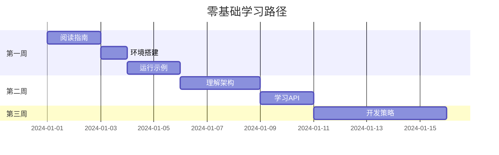
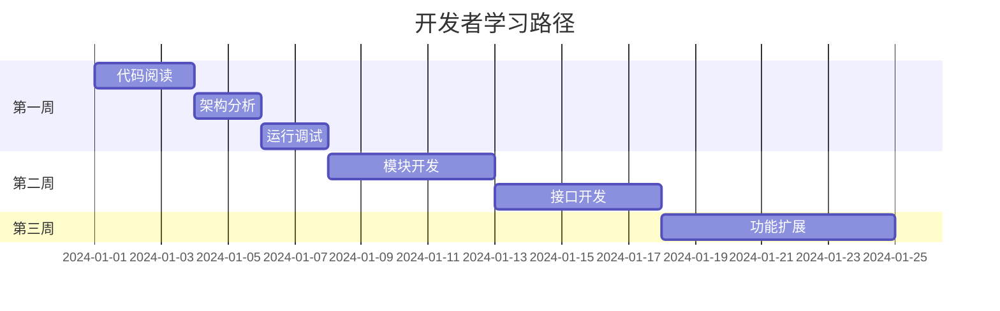
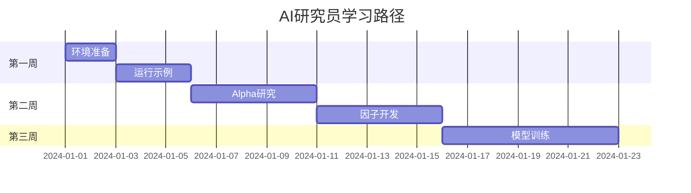

# VeighNa 学习资料索引

> **零基础小白的完整学习路径**

## 🎯 学习资料总览

我为VeighNa框架创建了**5份详细的学习资料**，从不同角度帮助你理解和掌握这个强大的量化交易框架：

| 📚 资料名称 | 🎯 主要内容 | 👥 适合人群 | 📖 阅读顺序 |
|------------|------------|------------|------------|
| [VeighNa_Framework_Complete_Guide.md](VeighNa_Framework_Complete_Guide.md) | 项目概述、架构解析、运行逻辑 | 所有用户 | ⭐ 第一本 |
| [Architecture_Diagrams.md](Architecture_Diagrams.md) | 架构图、流程图、时序图 | 开发者 | ⭐⭐ 第二本 |
| [Running_Logic_Detail.md](Running_Logic_Detail.md) | 详细运行逻辑、数据流转 | 进阶用户 | ⭐⭐⭐ 第三本 |
| [File_Structure_Complete.md](File_Structure_Complete.md) | 完整文件结构、代码位置 | 所有用户 | ⭐⭐ 第二本 |
| [Quick_Reference_Guide.md](Quick_Reference_Guide.md) | 快速开始、API速查、常见问题 | 所有用户 | 💎 随时查阅 |

---

## 📚 详细资料介绍

### 📖 1. VeighNa_Framework_Complete_Guide.md

**🎯 核心内容：**
- 项目概述和核心功能
- 三层架构设计详解
- AI Alpha模块完整介绍
- 快速开始指南

**👥 适合：** 所有用户，特别是零基础小白

**📚 包含：**
- 🏗️ 架构层次图
- 🤖 AI模块工作流程
- 🚀 环境准备和安装步骤
- 📝 基础脚本示例

---

### 📖 2. Architecture_Diagrams.md

**🎯 核心内容：**
- 系统分层架构图
- 核心组件交互图
- 事件处理流程图
- 数据流动图

**👥 适合：** 开发者、架构师

**📚 包含：**
- 🏗️ 整体架构图
- 🔄 运行时架构
- 📡 事件处理机制
- 🌐 网关系统架构
- 🧠 AI模块架构

---

### 📖 3. Running_Logic_Detail.md

**🎯 核心内容：**
- 系统启动流程详解
- 事件处理机制深入分析
- 数据流转过程完整说明
- 交易执行流程详细解析

**👥 适合：** 进阶用户、开发者

**📚 包含：**
- 🚀 主程序启动时序
- 🔄 事件处理流程
- 📊 数据流动图
- 🎯 完整交易周期
- 🧠 AI工作流程

---

### 📖 4. File_Structure_Complete.md

**🎯 核心内容：**
- 项目根目录结构
- vnpy核心包详解
- trader交易平台结构
- alpha AI模块结构

**👥 适合：** 所有用户

**📚 包含：**
- 📁 完整目录树
- 🏗️ 核心文件说明
- 📊 重要文件功能表
- 🎯 学习路径建议

---

### 📖 5. Quick_Reference_Guide.md

**🎯 核心内容：**
- 5分钟快速开始
- 常用命令速查
- 核心概念解释
- API接口速查

**👥 适合：** 所有用户

**📚 包含：**
- 🚀 快速启动指南
- 📝 常用命令表
- 🎯 核心概念解释
- 💻 API速查表
- ❓ 常见问题解答

---

## 🎓 学习路径推荐

### 🆕 零基础小白路径

**学习步骤：**
1. 📖 阅读 `VeighNa_Framework_Complete_Guide.md`
2. 🚀 按照 `Quick_Reference_Guide.md` 快速开始
3. 📁 查看 `File_Structure_Complete.md` 理解文件结构
4. 🏗️ 研究 `Architecture_Diagrams.md` 理解架构
5. 🔄 深入学习 `Running_Logic_Detail.md`

### 👨‍💻 开发者路径

**学习步骤：**
1. 📁 先研究 `File_Structure_Complete.md`
2. 🏗️ 深入分析 `Architecture_Diagrams.md`
3. 🔄 理解 `Running_Logic_Detail.md`
4. 📖 参考 `VeighNa_Framework_Complete_Guide.md`
5. 💎 随时查阅 `Quick_Reference_Guide.md`

### 🤖 AI研究员路径

**学习步骤：**
1. 🚀 快速开始 `Quick_Reference_Guide.md`
2. 📖 重点阅读 `VeighNa_Framework_Complete_Guide.md` 的AI部分
3. 🧠 深入研究 `Running_Logic_Detail.md` 的Alpha工作流程
4. 📊 实践Alpha研究示例

---

## 📚 资料内容对比

### 🏗️ 架构相关内容

| 资料 | 架构图 | 组件关系 | 数据流 | 适合程度 |
|------|--------|----------|--------|----------|
| Framework Guide | ✅ | ✅ | ✅ | ⭐⭐⭐ |
| Architecture Diagrams | ✅✅✅ | ✅✅✅ | ✅✅✅ | ⭐⭐⭐⭐⭐ |
| Running Logic | ✅✅ | ✅✅ | ✅✅✅ | ⭐⭐⭐⭐ |
| File Structure | ✅ | ✅ | ❌ | ⭐⭐ |
| Quick Reference | ❌ | ❌ | ❌ | ⭐ |

### 🤖 AI模块相关内容

| 资料 | AlphaLab | 因子计算 | 模型训练 | 适合程度 |
|------|----------|----------|----------|----------|
| Framework Guide | ✅✅ | ✅✅ | ✅✅ | ⭐⭐⭐⭐ |
| Architecture Diagrams | ✅✅✅ | ✅✅ | ✅✅ | ⭐⭐⭐⭐⭐ |
| Running Logic | ✅✅✅ | ✅✅✅ | ✅✅✅ | ⭐⭐⭐⭐⭐ |
| File Structure | ✅ | ✅ | ✅ | ⭐⭐⭐ |
| Quick Reference | ✅ | ✅ | ✅ | ⭐⭐ |

### 🚀 实践操作相关内容

| 资料 | 安装配置 | 运行示例 | API使用 | 适合程度 |
|------|----------|----------|----------|----------|
| Framework Guide | ✅✅ | ✅✅ | ✅ | ⭐⭐⭐ |
| Architecture Diagrams | ❌ | ❌ | ❌ | ⭐ |
| Running Logic | ✅ | ✅✅ | ✅ | ⭐⭐⭐ |
| File Structure | ✅ | ✅ | ✅ | ⭐⭐⭐ |
| Quick Reference | ✅✅✅ | ✅✅✅ | ✅✅✅ | ⭐⭐⭐⭐⭐ |

---

## 🎯 快速导航

### 🚀 我想快速开始

1. 📖 阅读 `Quick_Reference_Guide.md` 的"快速开始"部分
2. 🚀 运行 `python examples/veighna_trader/run.py`
3. 📝 查看最小启动脚本示例

### 🏗️ 我想了解架构

1. 📖 阅读 `VeighNa_Framework_Complete_Guide.md` 的"核心架构"
2. 🏗️ 查看 `Architecture_Diagrams.md` 的架构图
3. 🔄 理解 `Running_Logic_Detail.md` 的运行机制

### 🤖 我想学习AI模块

1. 📖 阅读 `VeighNa_Framework_Complete_Guide.md` 的"AI Alpha模块"
2. 🧠 查看 `Running_Logic_Detail.md` 的"AI Alpha工作流程"
3. 📊 运行 `examples/alpha_research/` 示例

### 💻 我想开发功能

1. 📁 研究 `File_Structure_Complete.md` 的文件结构
2. 🏗️ 分析 `Architecture_Diagrams.md` 的组件关系
3. 💎 查阅 `Quick_Reference_Guide.md` 的API速查

### ❓ 我遇到问题

1. 📚 查看 `Quick_Reference_Guide.md` 的"常见问题"
2. 🔍 搜索相关资料中的解决方案
3. 💬 到社区论坛寻求帮助

---

## 📚 额外资源

### 官方资源
- [VeighNa官方文档](https://www.vnpy.com/docs/cn/index.html)
- [官方社区论坛](https://www.vnpy.com/forum/)
- [GitHub仓库](https://github.com/vnpy/vnpy)

### 学习工具
- 🐍 Python 3.10+
- 📝 Jupyter Notebook
- 🧪 pytest
- 🔍 ruff (代码检查)
- 📊 mypy (类型检查)

### 社区支持
- 💬 QQ群: 262656087
- 📱 微信群: 扫描README中的二维码
- 🌐 论坛: [vnpy.com/forum](https://www.vnpy.com/forum/)

---

## 🎉 学习建议

### 📖 阅读建议

1. **循序渐进**: 从 `Framework Guide` 开始，逐步深入
2. **实践结合**: 边阅读边运行示例代码
3. **多查多问**: 遇到问题及时查阅和询问
4. **动手实践**: 多写代码，多调试

### 🚀 实践建议

1. **从小开始**: 先运行示例，再修改参数
2. **理解原理**: 不只是会用，更要理解为什么
3. **持续学习**: 量化交易是持续学习的过程
4. **安全第一**: 实盘前充分测试

### 🎯 进阶建议

1. **参与社区**: 多参与社区讨论
2. **贡献代码**: 尝试贡献自己的代码
3. **分享经验**: 分享自己的学习心得
4. **持续关注**: 关注框架更新和新功能

---

## 📞 获取帮助

### 📚 自助资源
1. 📖 仔细阅读本索引和各指南
2. 🔍 在指南中搜索关键词
3. 📝 查看官方文档
4. 💻 运行示例代码

### 👥 社区支持
1. 💬 社区论坛提问
2. 📱 微信群讨论
3. 🐧 QQ群交流
4. 📧 GitHub Issues

### 🎓 学习交流
1. 📚 分享学习心得
2. 🤝 互相帮助解决问题
3. 🎯 共同进步

---

## 🎊 总结

这5份学习资料构成了VeighNa框架的**完整学习体系**：

- 📖 **理论指导**: Framework Guide + Architecture Diagrams
- 🔧 **实践操作**: Running Logic + Quick Reference
- 📁 **代码导航**: File Structure

**建议收藏本索引**，在学习过程中随时参考，找到最适合的学习资料！

祝你学习愉快，早日掌握VeighNa框架！🚀✨