# VeighNa 运行逻辑详解

> **从零基础理解系统运行机制**

## 📚 目录

1. [系统启动流程](#系统启动流程)
2. [事件处理机制](#事件处理机制)
3. [数据流转过程](#数据流转过程)
4. [交易执行流程](#交易执行流程)
5. [AI Alpha工作流程](#ai-alpha工作流程)
6. [多进程通信](#多进程通信)
7. [错误处理机制](#错误处理机制)

---

## 系统启动流程

### 🚀 主程序启动

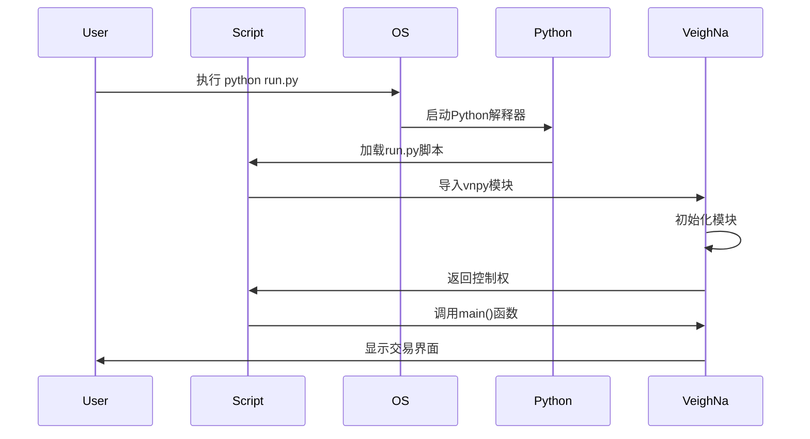

### 🏗️ 组件初始化顺序

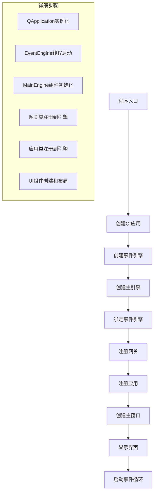

### 🔄 初始化时序图

```mermaid
sequenceDiagram
    participant main.py
    participant create_qapp()
    participant EventEngine
    participant MainEngine
    participant Gateway
    participant App
    participant MainWindow

    main.py->>create_qapp(): 创建Qt应用
    create_qapp()-->>main.py: 返回QApplication

    main.py->>EventEngine: 实例化事件引擎
    EventEngine->>EventEngine: 启动事件处理线程
    EventEngine-->>main.py: 返回引擎实例

    main.py->>MainEngine: 实例化主引擎
    MainEngine->>MainEngine: 初始化组件字典
    MainEngine-->>main.py: 返回引擎实例

    main.py->>MainEngine: add_gateway(CtpGateway)
    MainEngine->>MainEngine: 注册网关类

    main.py->>MainEngine: add_app(CtaStrategyApp)
    MainEngine->>MainEngine: 注册应用类

    main.py->>MainWindow: 创建主窗口
    MainWindow->>MainWindow: 初始化UI组件
    MainWindow-->>main.py: 返回窗口实例

    main.py->>MainWindow: showMaximized()
    MainWindow->>MainWindow: 显示最大化窗口

    main.py->>QApplication: exec()
    QApplication->>QApplication: 启动事件循环
```

---

## 事件处理机制

### 📡 事件类型定义

```python
# 核心事件类型
EVENT_TICK = "eTick"                    # 行情数据
EVENT_BAR = "eBar"                      # K线数据
EVENT_ORDER = "eOrder"                  # 订单数据
EVENT_TRADE = "eTrade"                  # 成交数据
EVENT_POSITION = "ePosition"            # 持仓数据
EVENT_ACCOUNT = "eAccount"              # 账户数据
EVENT_CONTRACT = "eContract"            # 合约数据
EVENT_LOG = "eLog"                      # 日志数据
EVENT_QUOTE = "eQuote"                  # 报价数据
```

### 🔄 事件处理流程

```mermaid
flowchart TD
    A[事件源] --> B{事件类型判断}
    B -->|行情数据| C[创建Tick事件]
    B -->|订单确认| D[创建Order事件]
    B -->|成交回报| E[创建Trade事件]
    B -->|其他数据| F[创建对应事件]

    C --> G[EventEngine.put()]
    D --> G
    E --> G
    F --> G

    G --> H[事件队列]
    H --> I[事件处理线程]
    I --> J{分发事件}
    J --> K[处理器1]
    J --> L[处理器2]
    J --> M[处理器3]

    K --> N[处理完成]
    L --> N
    M --> N
```

### 🎯 事件处理器注册

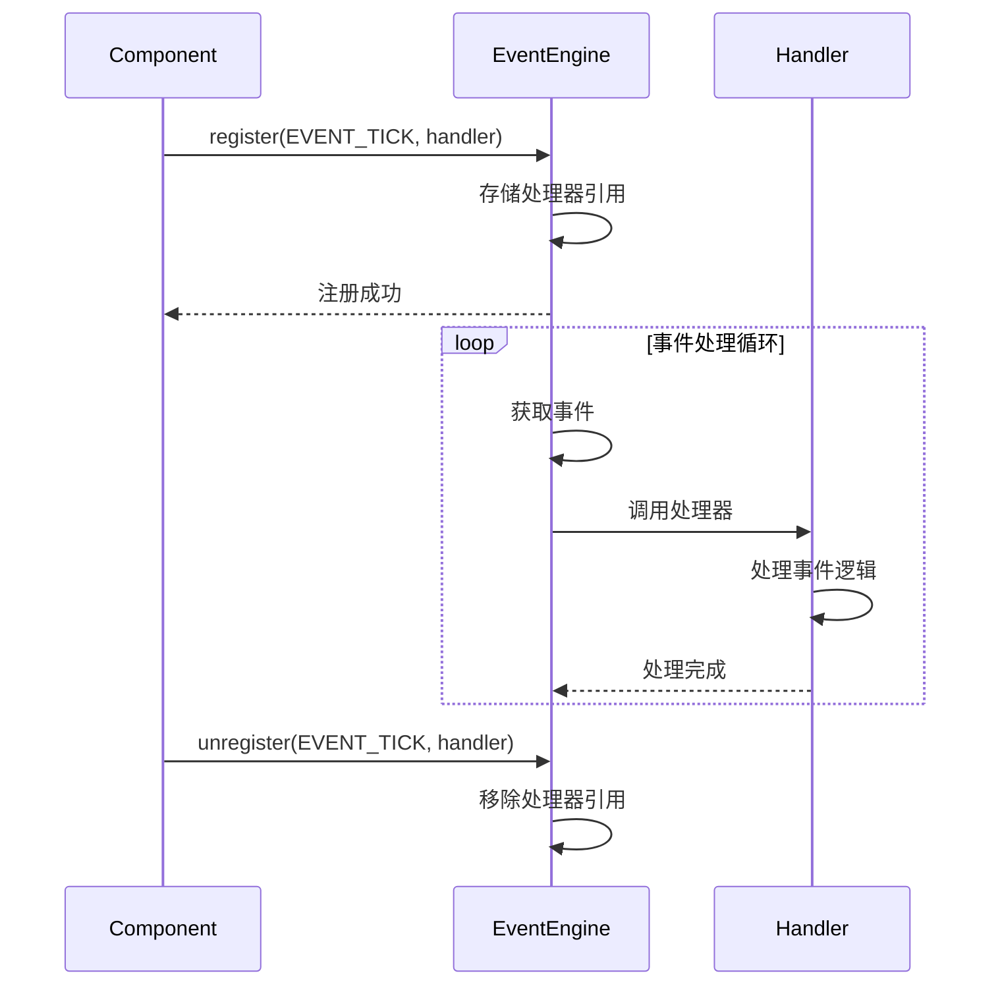

### 📊 事件处理示例

```python
class MyStrategy:
    def __init__(self, engine):
        self.engine = engine
        # 注册Tick事件处理器
        self.engine.event_engine.register(EVENT_TICK, self.on_tick)

    def on_tick(self, event):
        """处理Tick事件"""
        tick = event.data  # 获取Tick数据

        # 策略逻辑
        if tick.last_price > tick.ask_price_1:
            self.buy(tick.last_price, 1)

    def destroy(self):
        """清理资源"""
        # 注销事件处理器
        self.engine.event_engine.unregister(EVENT_TICK, self.on_tick)
```

---

## 数据流转过程

### 📈 行情数据流

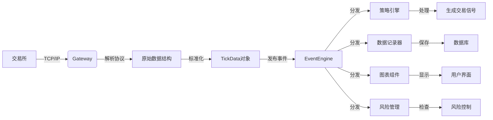

### 📤 订单数据流

```mermaid
flowchart TD
    A[策略逻辑] -->|分析信号| B{生成订单}
    B -->|买入| C[创建Buy订单]
    B -->|卖出| D[创建Sell订单]

    C --> E[OrderRequest对象]
    D --> E

    E --> F[MainEngine.send_order()]
    F --> G[Gateway.send_order()]
    G --> H[交易所API]
    H --> I[交易所]

    I -->|确认| J[Gateway.on_order()]
    J --> K[创建OrderData]
    K --> L[发布EVENT_ORDER]
    L --> M[EventEngine]
    M --> N[策略更新状态]
```

### 💰 成交数据流

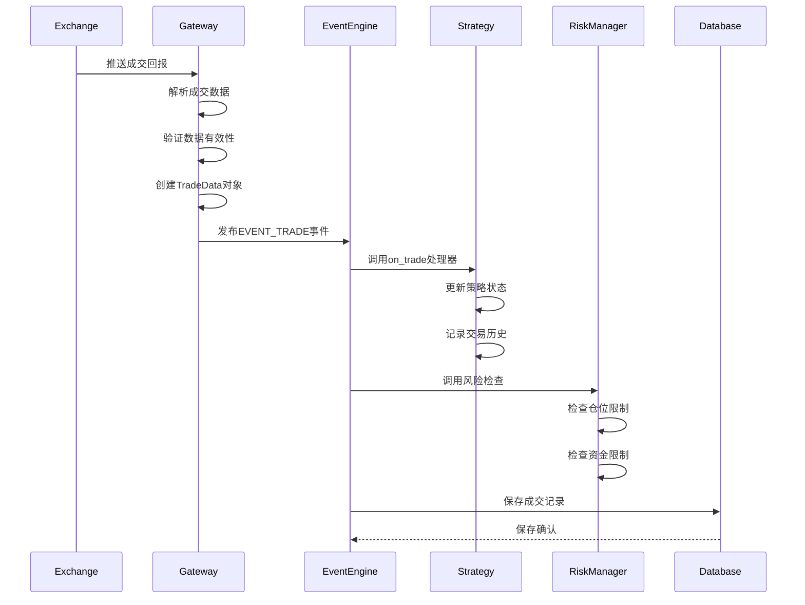

---

## 交易执行流程

### 🎯 完整交易周期

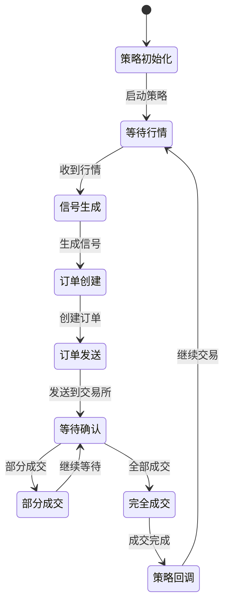

### 📊 订单状态转换

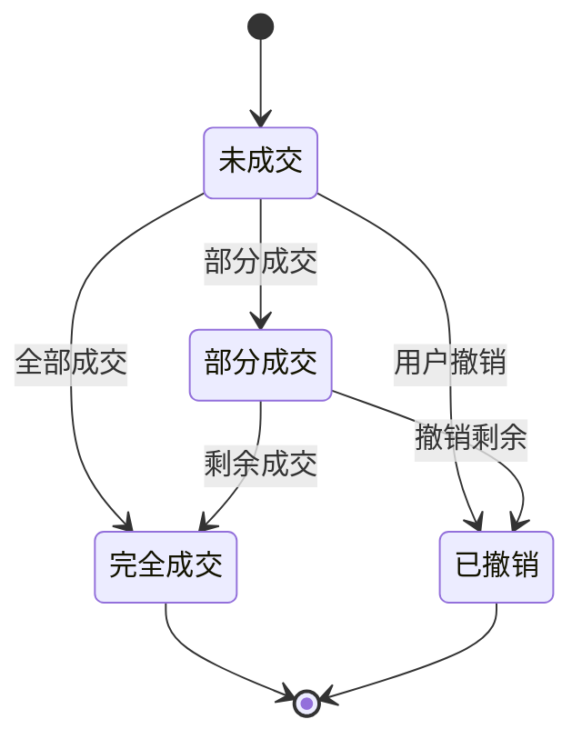

### 🔄 交易执行时序

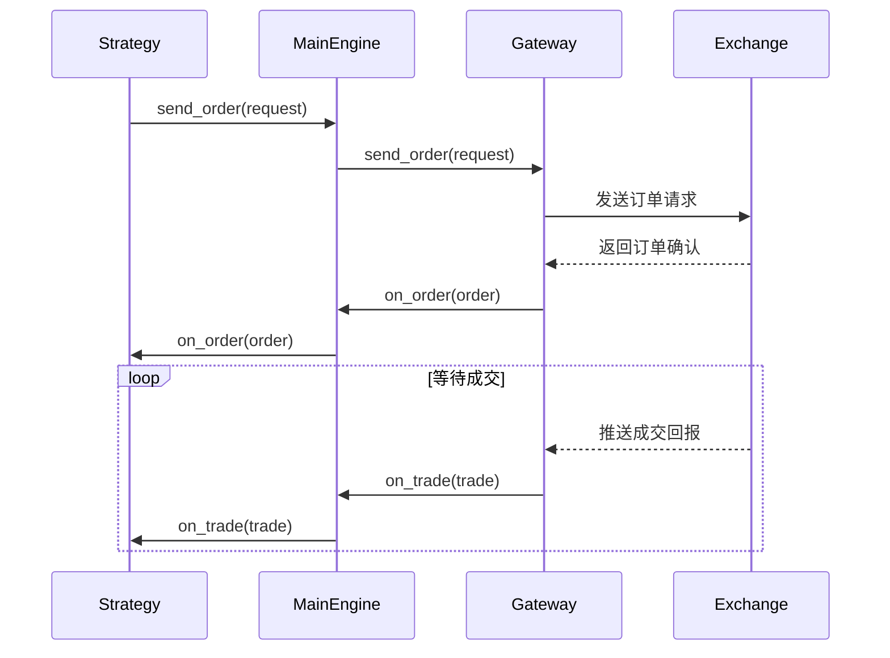

---

## AI Alpha工作流程

### 🧠 研究到交易流程

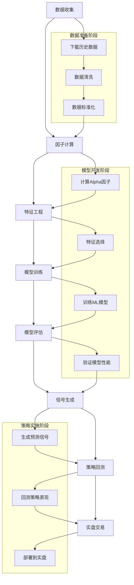

### 📊 Alpha研究时序

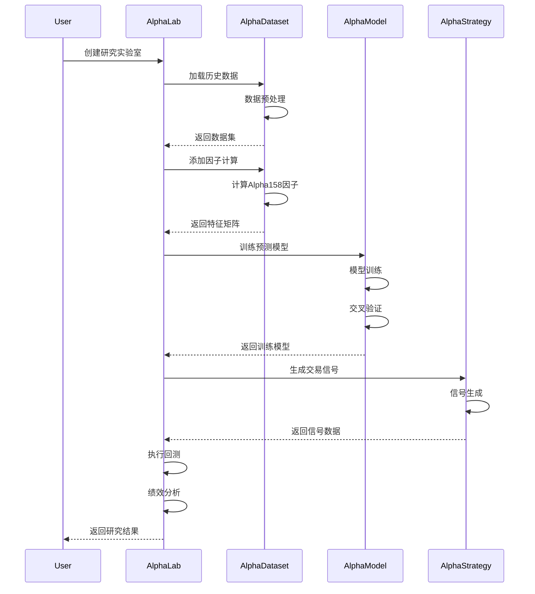

### 🤖 模型训练流程

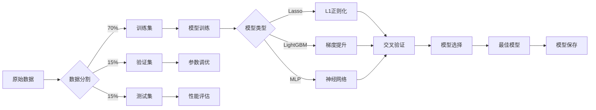

---

## 多进程通信

### 🔄 RPC通信架构

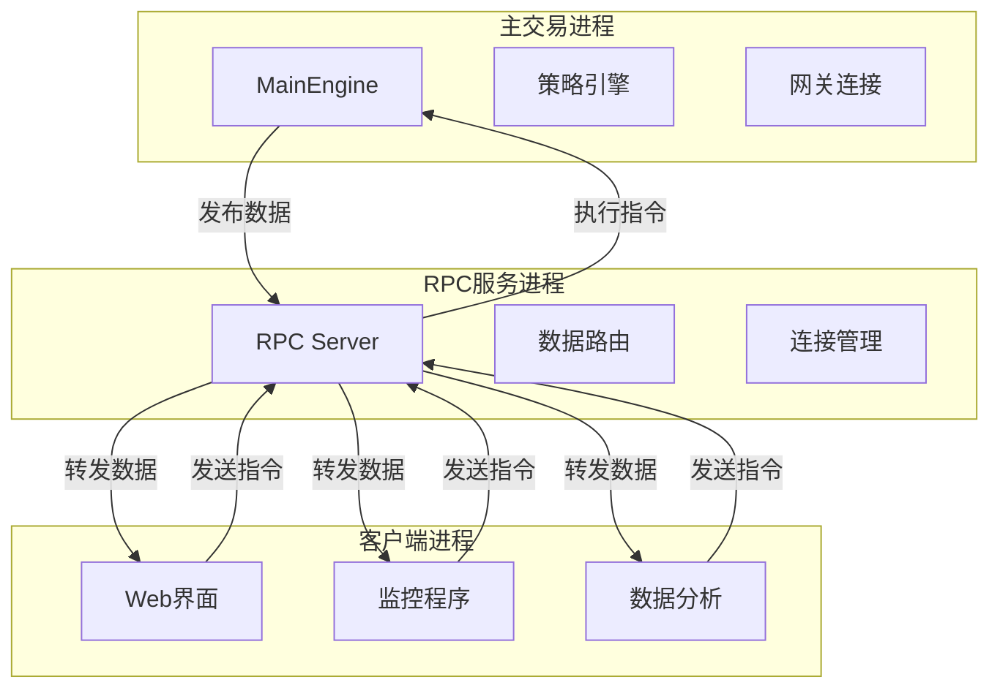

### 📡 通信协议

```python
# 请求消息格式
class RpcRequest:
    def __init__(self):
        self.msg_type = ""      # 消息类型
        self.target = ""        # 目标组件
        self.command = ""       # 执行命令
        self.data = {}          # 参数数据
        self.timestamp = None   # 时间戳

# 响应消息格式
class RpcResponse:
    def __init__(self):
        self.success = False    # 执行结果
        self.data = {}          # 返回数据
        self.error = ""          # 错误信息
        self.timestamp = None   # 时间戳
```

### 🔄 通信时序

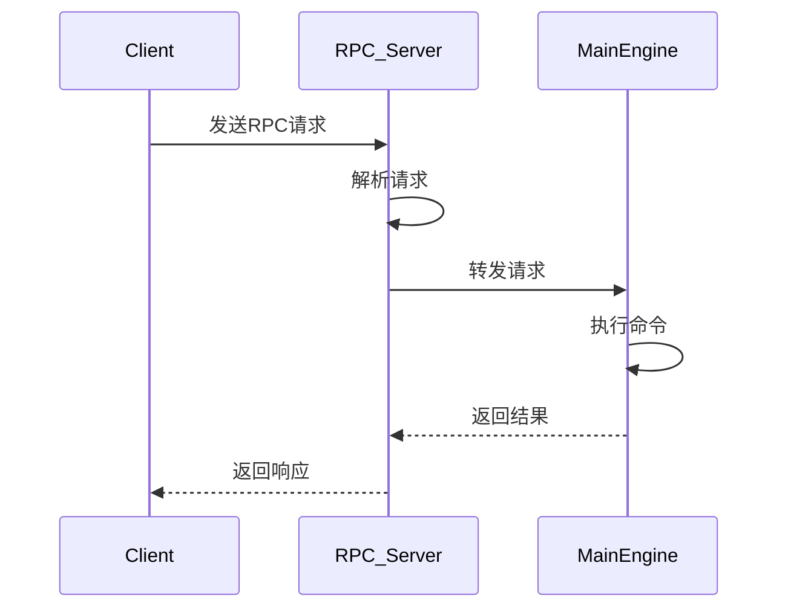

---

## 错误处理机制

### 🛡️ 异常处理层次

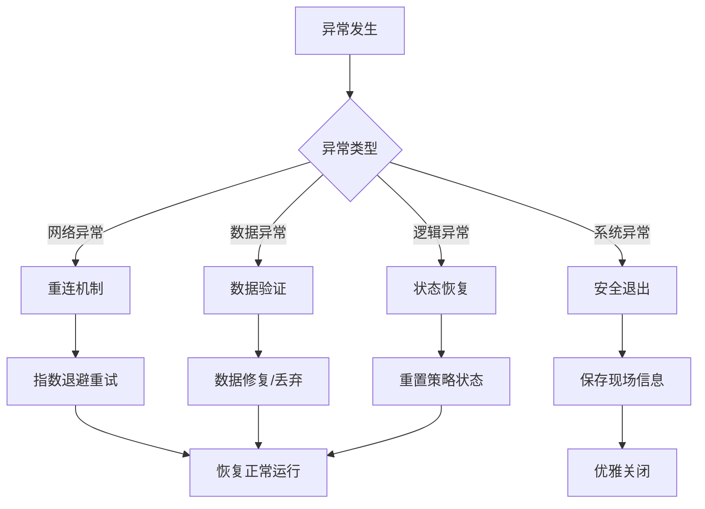

### 📝 日志记录系统

```python
# 日志级别
DEBUG = 10      # 调试信息
INFO = 20       # 一般信息
WARNING = 30    # 警告信息
ERROR = 40      # 错误信息
CRITICAL = 50   # 严重错误

# 日志格式
"""
[2024-01-15 10:30:45] [INFO] [MainEngine] Gateway CTP connected successfully
[2024-01-15 10:30:46] [DEBUG] [CtaStrategy] Received tick data for rb2401
[2024-01-15 10:30:47] [ERROR] [CtpGateway] Failed to send order: Network timeout
"""
```

### 🔄 错误恢复流程

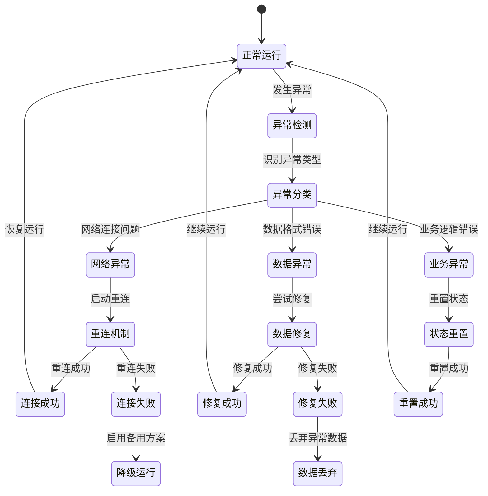

---

## 总结

通过这份详细的运行逻辑说明，我们可以清楚地理解：

1. **启动机制**: 从脚本执行到界面显示的完整流程
2. **事件驱动**: 高效的事件处理和分发机制
3. **数据流转**: 从原始数据到交易信号的完整转换
4. **交易执行**: 订单从创建到成交的完整生命周期
5. **AI集成**: 从研究到实盘的机器学习工作流
6. **通信架构**: 多进程间的协同工作机制
7. **错误处理**: 系统的健壮性和可靠性保障

这些机制共同构成了VeighNa强大的量化交易能力。🚀