# VeighNa 量化交易框架完全手册

> **零基础到精通的完整学习指南**

## 🎯 手册目标

本手册旨在为**零基础小白**提供VeighNa量化交易框架的**完整学习路径**，通过：

- 📚 **详细的项目结构分析**
- 🏗️ **清晰的架构图解**
- 🔄 **完整的运行逻辑说明**
- 🚀 **实用的快速参考**

帮助你从**完全不懂**到**熟练使用**VeighNa框架。

---

## 📚 手册目录

### 第一部分：项目概览
1. [什么是VeighNa？](#什么是veighna)
2. [核心功能特点](#核心功能特点)
3. [适用人群](#适用人群)

### 第二部分：项目结构
4. [整体架构](#整体架构)
5. [文件结构详解](#文件结构详解)
6. [模块关系图](#模块关系图)

### 第三部分：运行原理
7. [启动流程](#启动流程)
8. [事件处理机制](#事件处理机制)
9. [数据流转过程](#数据流转过程)

### 第四部分：AI Alpha模块
10. [Alpha研究实验室](#alpha研究实验室)
11. [因子计算引擎](#因子计算引擎)
12. [模型训练流程](#模型训练流程)

### 第五部分：实战应用
13. [快速开始](#快速开始)
14. [开发指南](#开发指南)
15. [最佳实践](#最佳实践)

---

## 什么是VeighNa？

### 🎯 项目定位

VeighNa是一个**基于Python的开源量化交易系统开发框架**，专为量化交易员设计。它提供了一套完整的量化交易解决方案。

### 🏗️ 设计理念

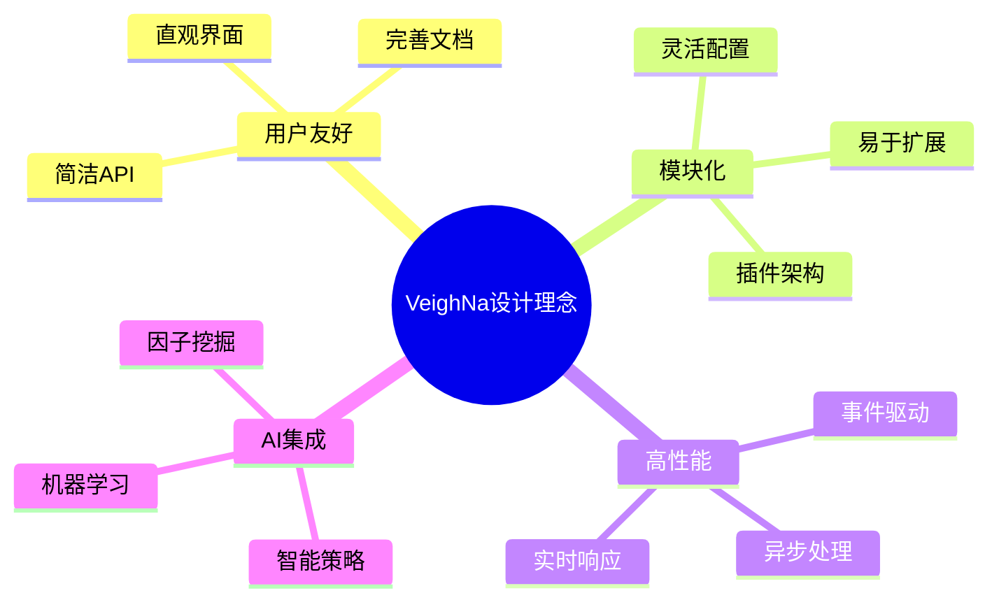

### 🌟 核心优势

| 优势 | 说明 | 受益用户 |
|------|------|----------|
| **功能完整** | 覆盖量化交易全流程 | 量化研究员 |
| **接口丰富** | 支持多种交易场所 | 交易员 |
| **AI驱动** | 内置机器学习模块 | 算法工程师 |
| **开源免费** | MIT许可证 | 所有用户 |

---

## 核心功能特点

### 🏗️ 三大核心模块

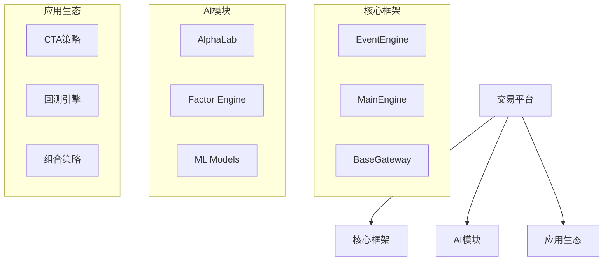

### 🌐 支持的交易接口

| 接口类型 | 中国市场 | 海外市场 | 数据服务 |
|----------|----------|----------|----------|
| **期货** | CTP、CTP Mini、飞马 | IB、易盛外盘 | RQData、迅投研 |
| **股票** | XTP、华鑫奇点 | Interactive Brokers | TuShare、Wind |
| **期权** | CTP证券、顶点 | - | - |
| **其他** | 黄金TD、银行间 | 直达期货 | 天勤、掘金 |

### 🤖 AI Alpha模块功能

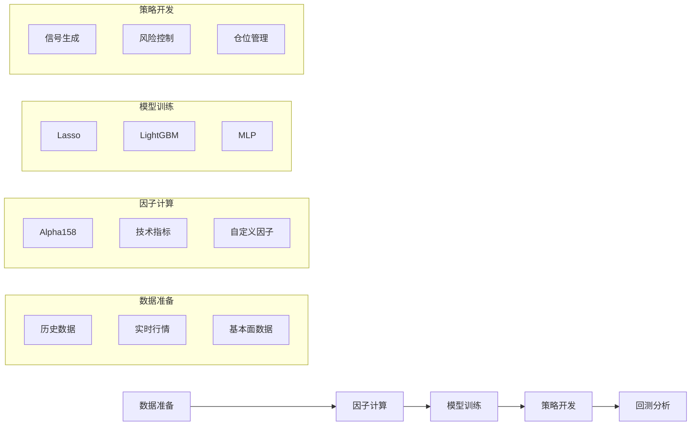

---

## 适用人群

### 🎯 目标用户画像

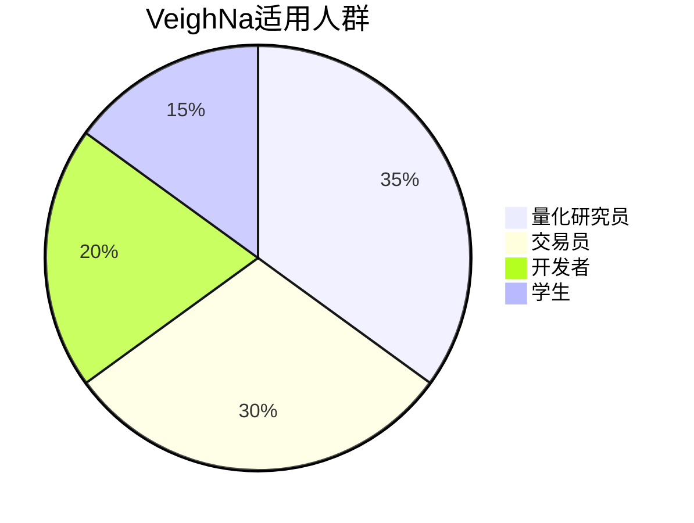

### 👨‍🎓 不同用户的学习路径

#### 量化研究员
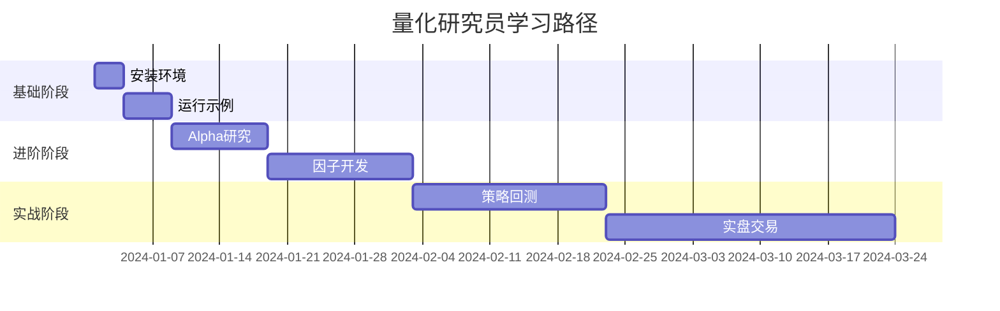

#### 交易员
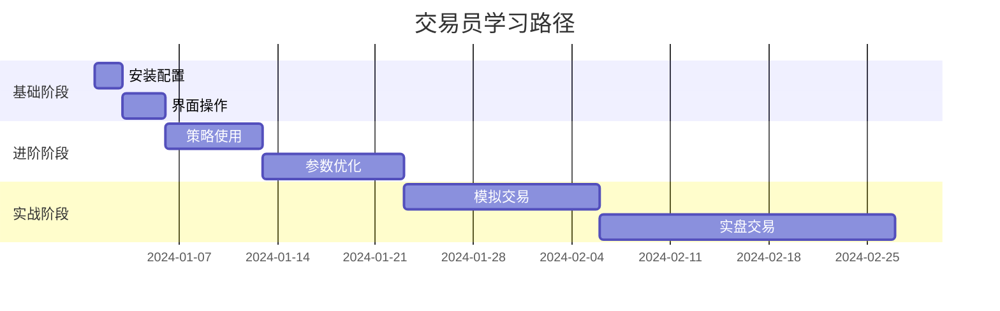

#### 开发者
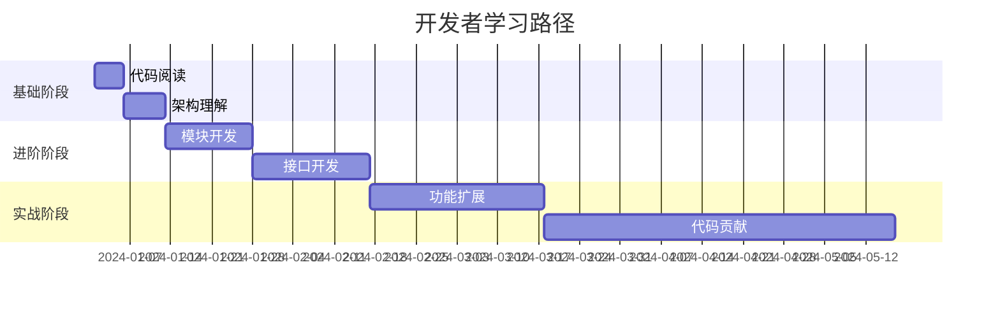

---

## 整体架构

### 🏗️ 系统架构图

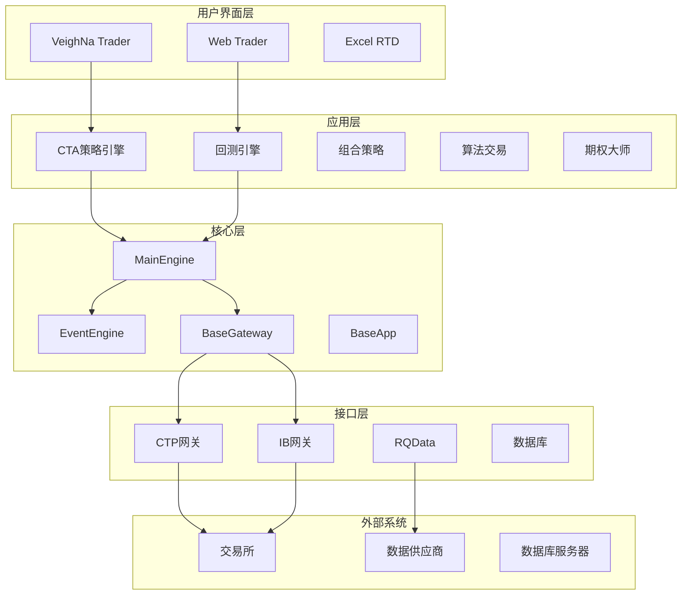

### 🔄 数据流架构

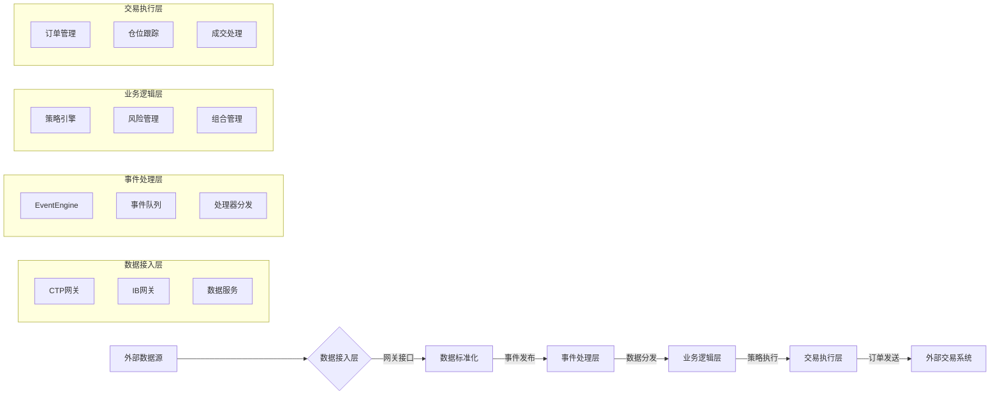

### 🧠 核心组件关系

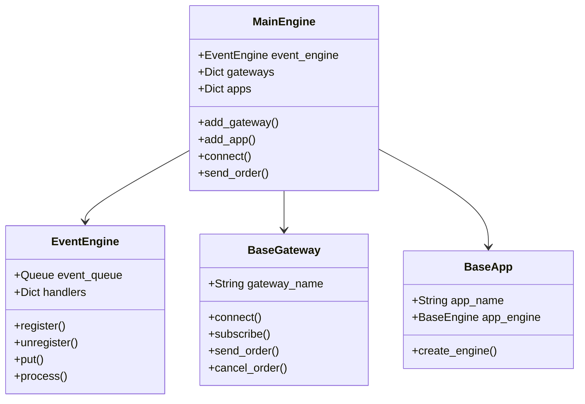

---

## 文件结构详解

### 📁 项目根目录结构

```
/Users/heshi/Quant/quant/
├── 📁 vnpy/                       # 核心框架包
│   ├── 📁 alpha/                 # AI驱动Alpha模块
│   ├── 📁 chart/                 # 高性能图表
│   ├── 📁 event/                 # 事件驱动引擎
│   ├── 📁 rpc/                   # 跨进程通信
│   └── 📁 trader/                # 交易平台核心
├── 📁 examples/                  # 示例代码
│   ├── 📁 alpha_research/        # Alpha研究示例
│   ├── 📁 veighna_trader/        # 交易界面示例
│   └── 📁 client_server/         # RPC通信示例
├── 📁 tests/                     # 测试文件
│   ├── 📄 test_alpha101.py      # Alpha101测试
│   └── 📄 test_event_engine.py  # 事件引擎测试
├── 📁 docs/                      # 项目文档
├── 📄 README.md                 # 项目说明
├── 📄 CLAUDE.md                # 开发指南
└── 📄 main.py                   # 主程序入口
```

### 🏗️ vnpy核心包结构

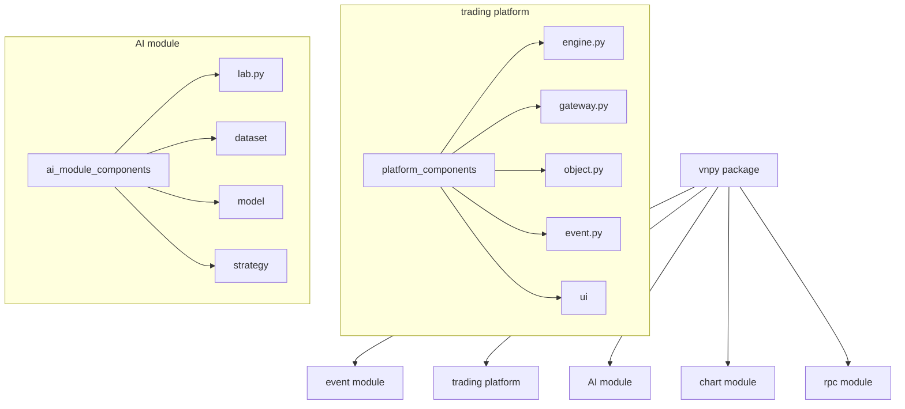

### 📊 重要文件功能说明

| 文件路径 | 主要功能 | 关键类/函数 |
|----------|----------|-------------|
| `vnpy/trader/engine.py` | 主引擎实现 | `MainEngine`, `BaseEngine` |
| `vnpy/trader/gateway.py` | 网关基类 | `BaseGateway` |
| `vnpy/trader/object.py` | 数据对象 | `TickData`, `BarData`, `OrderData` |
| `vnpy/event/event_engine.py` | 事件引擎 | `EventEngine` |
| `vnpy/alpha/lab.py` | Alpha实验室 | `AlphaLab` |
| `examples/veighna_trader/run.py` | 启动示例 | `main()` |

---

## 模块关系图

### 🏗️ 核心模块依赖关系

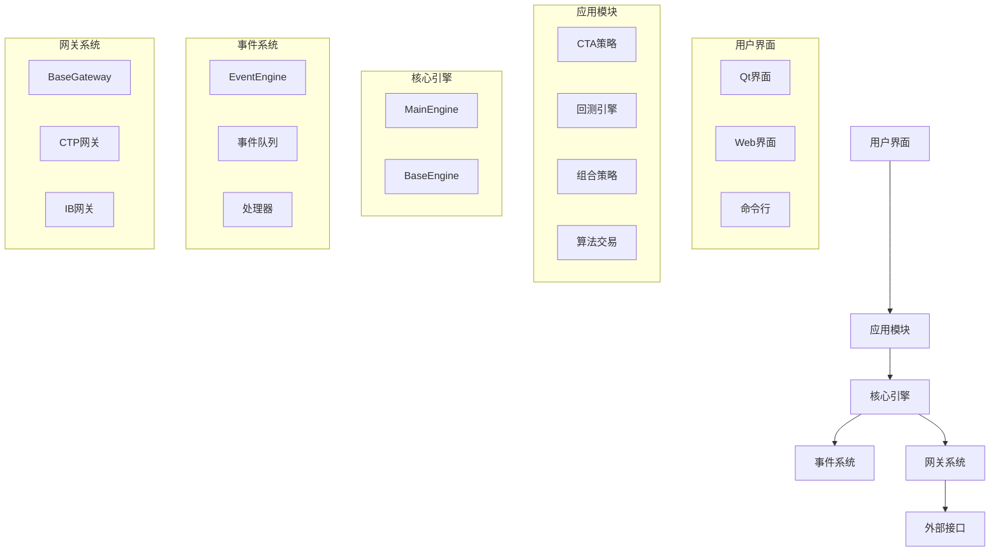

### 🔄 数据流向图

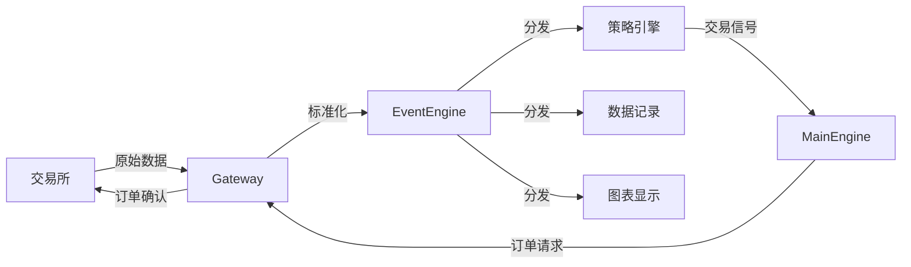

---

## 启动流程

### 🚀 程序启动时序

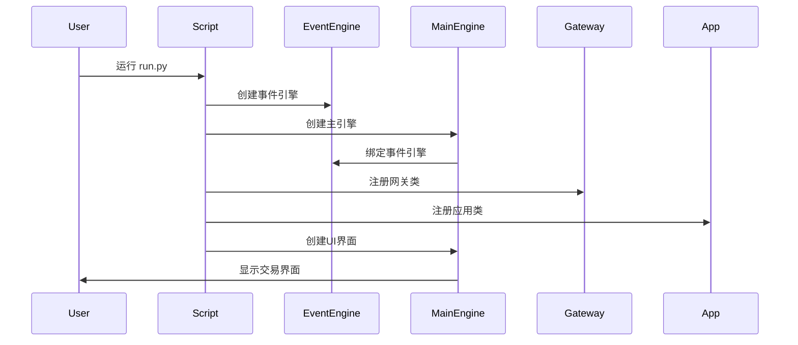

### 🏗️ 组件初始化流程

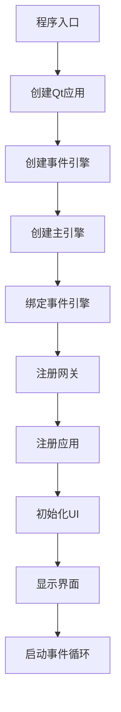

### 🔄 初始化详细步骤

1. **创建Qt应用** (`create_qapp()`)
   - 初始化Qt应用程序
   - 设置事件循环

2. **创建事件引擎** (`EventEngine()`)
   - 初始化事件队列
   - 启动事件处理线程

3. **创建主引擎** (`MainEngine()`)
   - 初始化组件字典
   - 绑定事件引擎

4. **注册网关** (`add_gateway()`)
   - 注册网关类到引擎
   - 准备连接外部系统

5. **注册应用** (`add_app()`)
   - 注册应用类到引擎
   - 初始化策略引擎

6. **创建UI界面** (`MainWindow()`)
   - 初始化界面组件
   - 绑定引擎和事件

7. **显示界面** (`showMaximized()`)
   - 显示最大化窗口
   - 准备接收用户输入

8. **启动事件循环** (`exec()`)
   - 启动Qt事件循环
   - 开始处理所有事件

---

## 事件处理机制

### 📡 事件类型定义

```python
# 核心事件类型
EVENT_TICK = "eTick"        # 行情数据
EVENT_BAR = "eBar"          # K线数据
EVENT_ORDER = "eOrder"      # 订单数据
EVENT_TRADE = "eTrade"      # 成交数据
EVENT_POSITION = "ePosition" # 持仓数据
EVENT_ACCOUNT = "eAccount"  # 账户数据
EVENT_CONTRACT = "eContract" # 合约数据
EVENT_LOG = "eLog"          # 日志数据
```

### 🔄 事件处理流程

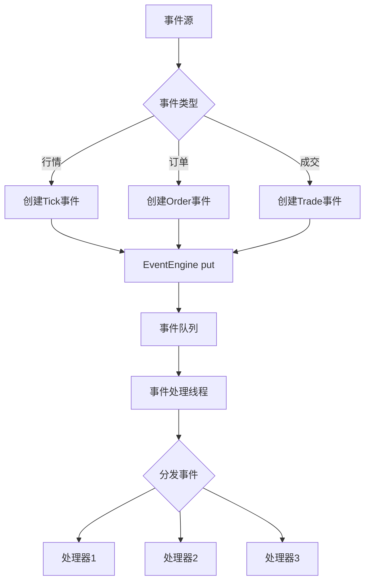

### 🎯 事件处理器注册

```python
class MyStrategy:
    def __init__(self, engine):
        self.engine = engine
        # 注册Tick事件处理器
        self.engine.event_engine.register(EVENT_TICK, self.on_tick)

    def on_tick(self, event):
        """处理Tick事件"""
        tick = event.data
        # 策略逻辑处理
        pass

    def destroy(self):
        # 注销事件处理器
        self.engine.event_engine.unregister(EVENT_TICK, self.on_tick)
```

---

## 数据流转过程

### 📈 行情数据流

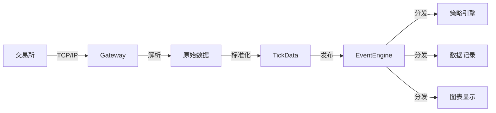

### 📤 订单数据流

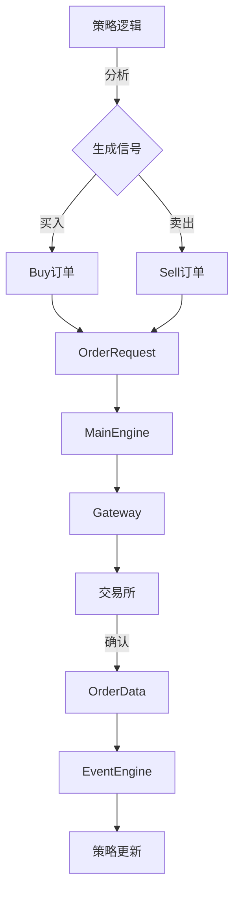

---

## Alpha研究实验室

### 🧠 AlphaLab架构

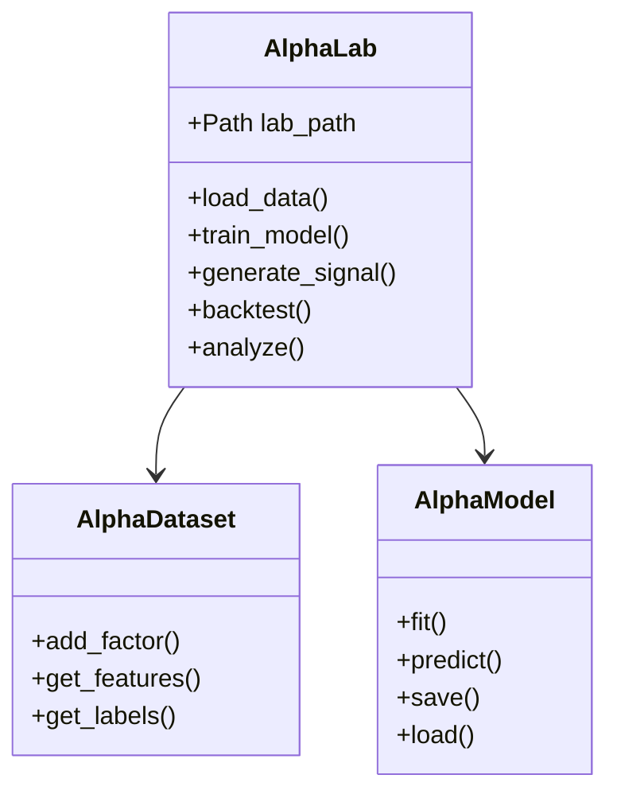

### 📊 研究工作流

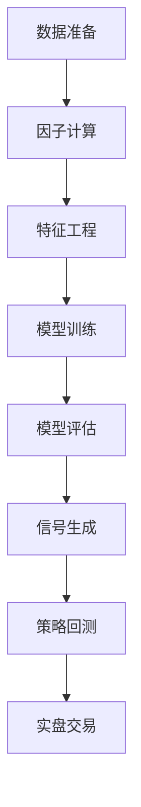

---

## 快速开始

### 🚀 5分钟启动

```bash
# 1. 安装
pip install -e .[alpha,dev]

# 2. 运行
python examples/veighna_trader/run.py
```

### 📝 最小示例

```python
from vnpy.event import EventEngine
from vnpy.trader.engine import MainEngine
from vnpy.trader.ui import MainWindow, create_qapp

# 创建应用和引擎
qapp = create_qapp()
event_engine = EventEngine()
main_engine = MainEngine(event_engine)

# 创建窗口并启动
main_window = MainWindow(main_engine, event_engine)
main_window.showMaximized()
qapp.exec()
```

---

## 开发指南

### 🎯 开发环境设置

```bash
# 创建虚拟环境
python -m venv .venv
source .venv/bin/activate

# 安装开发依赖
pip install -e .[alpha,dev]

# 安装开发工具
pip install ruff mypy pytest jupyter
```

### 📝 代码规范

```python
# 使用类型注解
def my_function(param: str) -> int:
    return len(param)

# 遵循PEP 8
class MyClass:
    def __init__(self):
        self.value = 0

    def my_method(self):
        pass
```

### 🧪 测试规范

```bash
# 运行测试
python -m pytest tests/ -v

# 代码检查
ruff check .
mypy vnpy
```

---

## 最佳实践

### 🎯 策略开发最佳实践

1. **策略结构**
   ```python
   class MyStrategy(CtaTemplate):
       def on_init(self):
           """初始化"""
           pass

       def on_tick(self, tick):
           """处理Tick"""
           pass
   ```

2. **错误处理**
   ```python
   try:
       # 策略逻辑
       pass
   except Exception as e:
       self.write_log(f"策略错误: {e}")
   ```

3. **日志记录**
   ```python
   self.write_log("策略启动")
   self.write_log(f"买入信号: {signal}")
   ```

### 🤖 Alpha研究最佳实践

1. **数据质量**
   - 确保数据完整性
   - 处理缺失值和异常值

2. **因子选择**
   - 选择有经济意义的因子
   - 避免过拟合

3. **模型评估**
   - 使用多个评估指标
   - 进行样本外测试

---

## 📚 学习资源

### 官方文档
- [VeighNa项目文档](https://www.vnpy.com/docs/cn/index.html)
- [官方社区论坛](https://www.vnpy.com/forum/)

### 代码学习
1. 从 `examples/` 开始
2. 阅读 `vnpy/trader/` 核心代码
3. 研究 `tests/` 测试用例

### 社区支持
- QQ群: 262656087
- 微信群: 扫描README二维码

---

## 🎉 总结

本手册提供了VeighNa框架的**完整学习路径**：

- 📚 **理论基础**: 理解架构和原理
- 🏗️ **实践操作**: 从安装到开发
- 🤖 **AI集成**: 机器学习应用
- 🚀 **进阶开发**: 自定义扩展

**建议学习顺序**:
1. 阅读本手册
2. 运行示例代码
3. 修改策略参数
4. 开发自定义策略
5. 探索AI模块

祝你学习愉快！🎯✨