# VeighNa 量化交易框架完全指南

> **面向零基础小白的详细说明书**

## 📚 目录

1. [项目概述](#项目概述)
2. [核心架构](#核心架构)
3. [项目结构详解](#项目结构详解)
4. [运行流程](#运行流程)
5. [AI Alpha模块](#ai-alpha模块)
6. [快速开始](#快速开始)

---

## 项目概述

VeighNa是一个基于Python的开源量化交易系统开发框架，专为量化交易员设计。它提供了一套完整的量化交易解决方案，包括：

- 📊 **多市场交易接口**：支持股票、期货、期权等多种交易品种
- 🤖 **AI驱动策略**：内置机器学习模块，支持因子挖掘和策略开发
- 🏗️ **模块化设计**：插件式架构，易于扩展和定制
- 📈 **高性能图表**：实时数据可视化和分析
- 🔄 **事件驱动**：高效的事件处理机制

### 🎯 主要特性

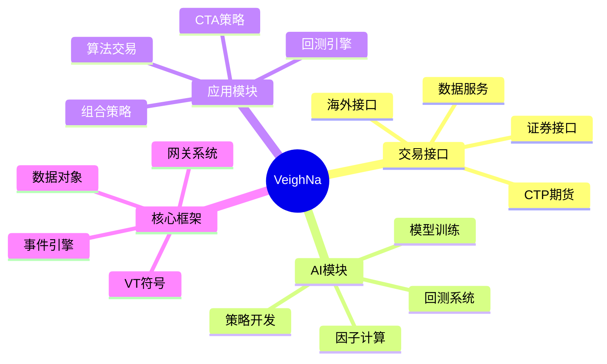

---

## 核心架构

VeighNa采用三层架构设计，层次分明，职责清晰：

### 🏗️ 架构层次图

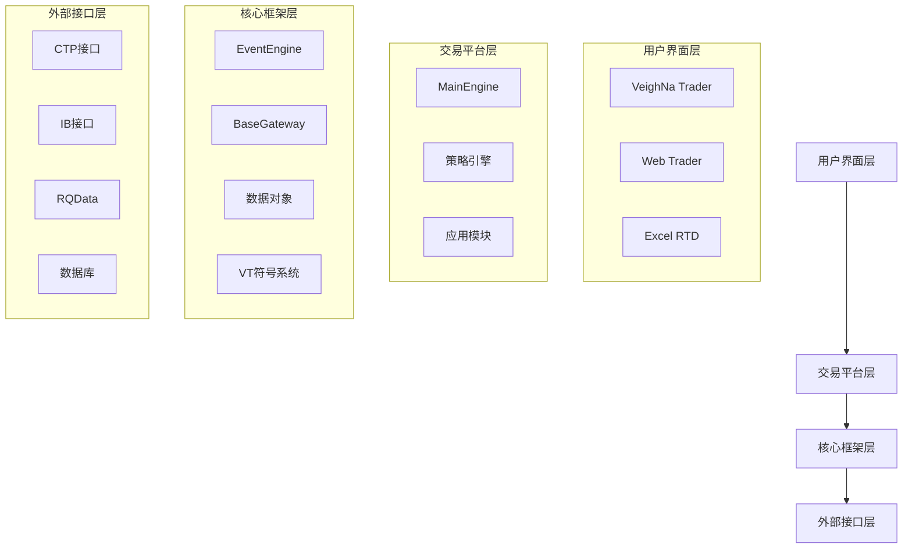

### 🔄 事件驱动架构

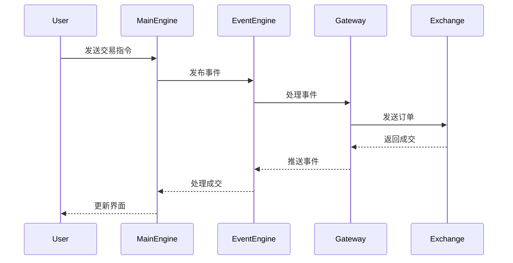

---

## 项目结构详解

### 📁 根目录结构

```
/Users/heshi/Quant/quant/
├── 📁 vnpy/                    # 核心框架包
├── 📁 examples/               # 示例代码
├── 📁 tests/                  # 测试文件
├── 📁 docs/                   # 文档
├── 📄 README.md              # 项目说明
├── 📄 CLAUDE.md              # 开发指南
└── 📄 main.py                # 主程序入口
```

### 🏗️ vnpy核心包结构

```mermaid
treeDiagram
    vnpy --> event
    vnpy --> trader
    vnpy --> alpha
    vnpy --> chart
    vnpy --> rpc

    trader --> engine.py        : "MainEngine核心引擎"
    trader --> gateway.py       : "BaseGateway网关基类"
    trader --> object.py        : "数据对象定义"
    trader --> event.py         : "事件常量"
    trader --> ui/              : "用户界面"

    alpha --> lab.py            : "Alpha研究实验室"
    alpha --> dataset/          : "因子特征工程"
    alpha --> model/            : "机器学习模型"
    alpha --> strategy/         : "策略模板"
```

### 📂 详细目录说明

#### 1. 核心框架 (vnpy/)

| 目录 | 说明 | 关键文件 |
|------|------|----------|
| `event/` | 事件驱动引擎 | `event_engine.py` |
| `trader/` | 主交易平台 | `engine.py`, `gateway.py` |
| `chart/` | 高性能图表 | `chart.py` |
| `rpc/` | 跨进程通信 | `server.py`, `client.py` |

#### 2. 交易平台 (vnpy.trader)

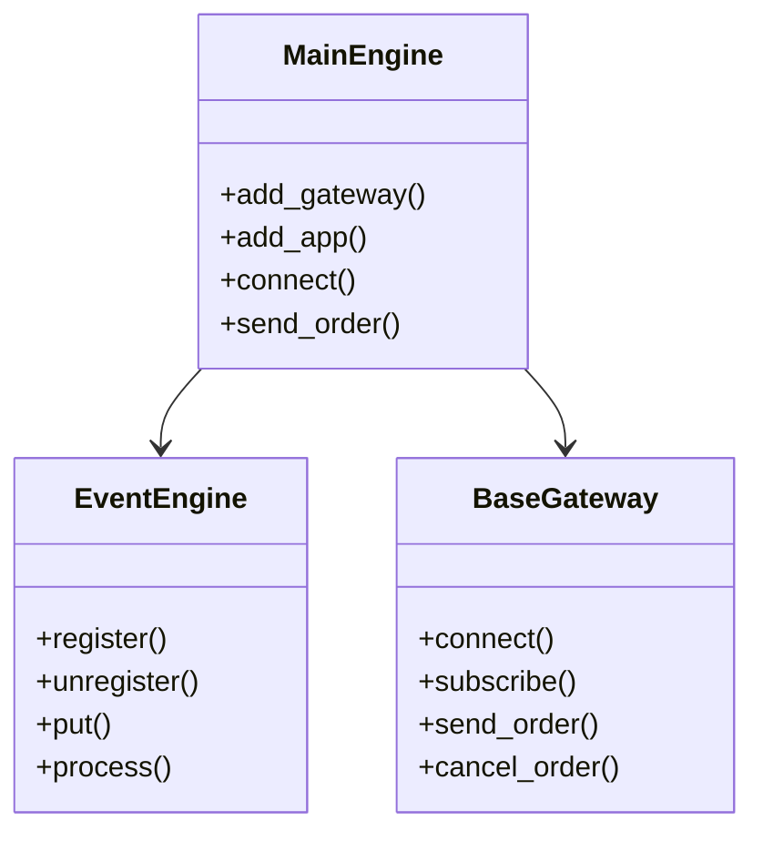

**关键组件说明：**

- **MainEngine**: 中央引擎，协调所有交易功能
- **BaseGateway**: 连接到交易场所的抽象接口
- **EventEngine**: 事件驱动的发布/订阅系统
- **VT符号系统**: `<网关>.<代码>` 格式，如 `CTP.SHFE.rb2401`

#### 3. AI Alpha模块 (vnpy.alpha)

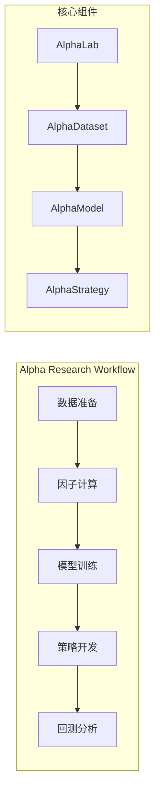

**工作流程详解：**

1. **数据准备**: 使用 AlphaDataset 加载市场数据
2. **因子计算**: 应用时间序列和截面函数计算因子
3. **模型训练**: 使用标准化的 AlphaModel 接口训练 ML 模型
4. **策略开发**: 创建使用 ML 信号的策略
5. **回测**: 使用集成实验室工作流进行测试

**内置模型：**
- **Lasso**: 经典Lasso回归，L1正则化特征选择
- **LightGBM**: 高效梯度提升决策树
- **MLP**: 多层感知机神经网络

#### 4. 网关系统

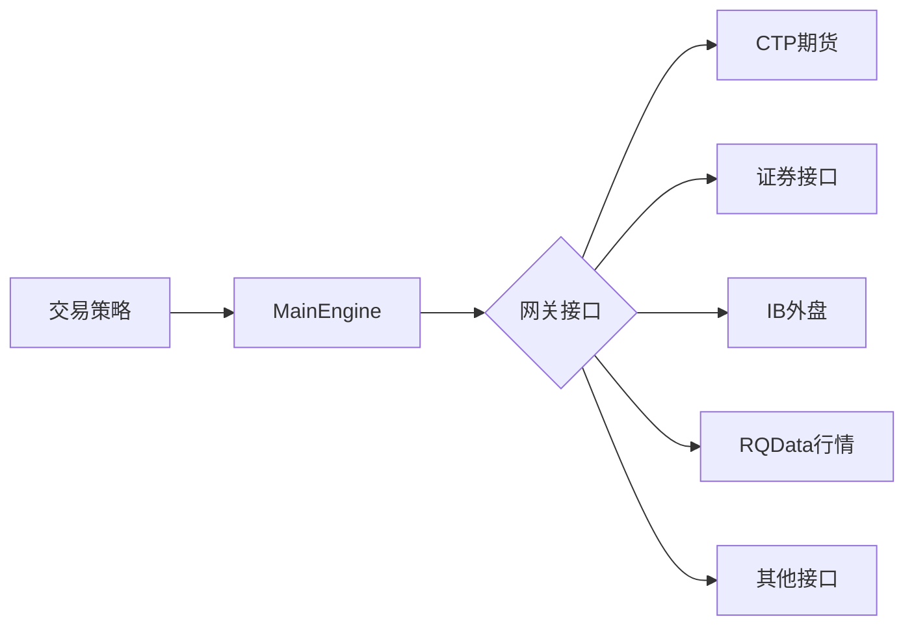

**支持的交易接口：**

| 接口类型 | 支持市场 | 状态 |
|----------|----------|------|
| CTP | 国内期货、期权 | ✅ |
| CTP Mini | 国内期货、期权 | ✅ |
| Interactive Brokers | 海外证券、期货 | ✅ |
| RQData | 跨市场行情数据 | ✅ |

#### 5. 应用程序模块

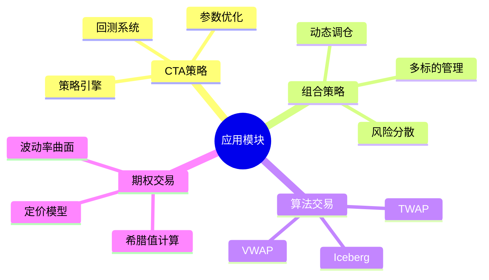

---

## 运行流程

### 🚀 启动流程

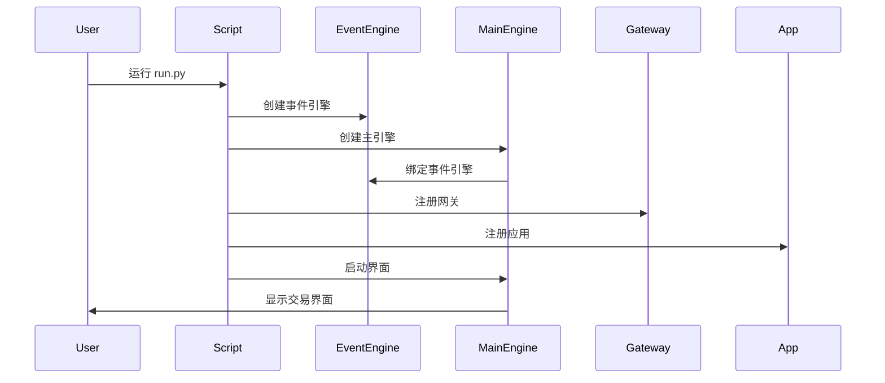

### 📊 数据流

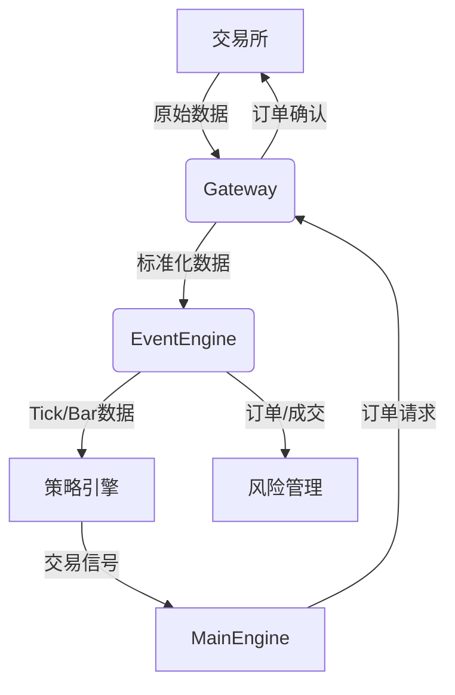

### 🔄 事件处理流程

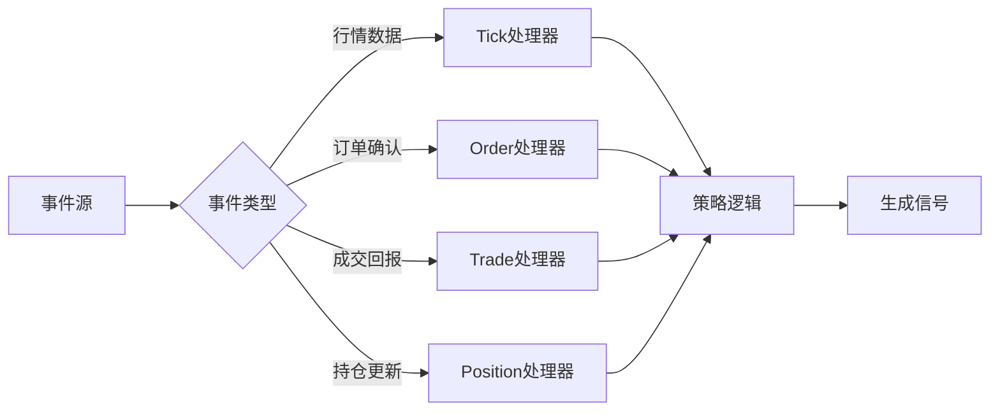

---

## AI Alpha模块

### 🧠 Alpha研究实验室

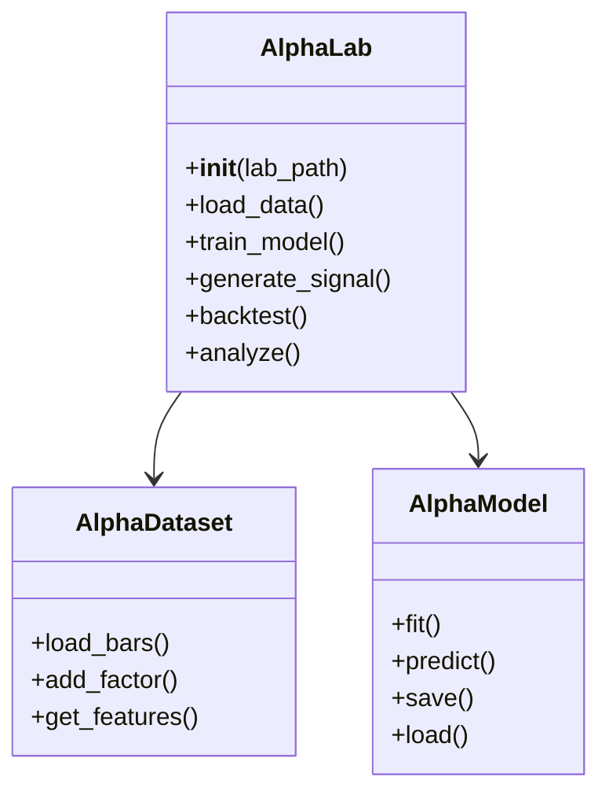

### 📊 因子计算引擎

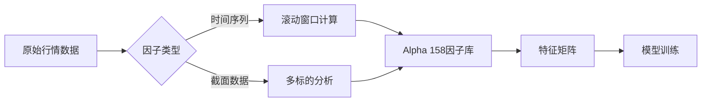

**内置因子类型：**

- **K线形态因子**: 识别各种K线模式
- **价格趋势因子**: 捕捉价格变化趋势
- **时序波动因子**: 分析价格波动特性
- **成交量因子**: 量价关系分析
- **资金流因子**: 资金流向分析

### 🤖 模型训练流程

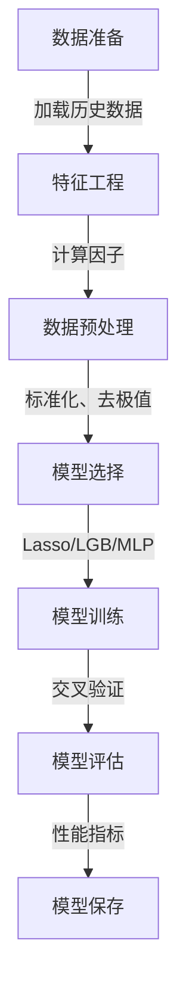

### 📈 策略回测

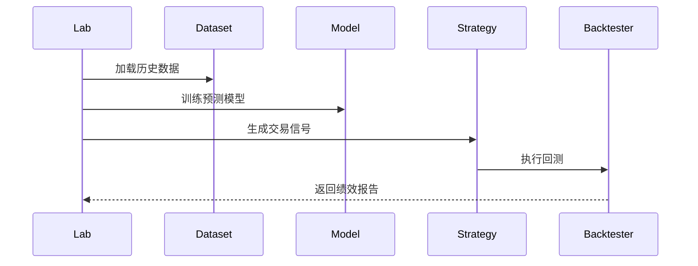

---

## 快速开始

### 🛠️ 环境准备

```bash
# 创建虚拟环境
python -m venv .venv && source .venv/bin/activate

# 安装依赖
pip install -e .[alpha,dev]

# 验证安装
python -c "from vnpy import __version__; print(__version__)"
```

### 📝 基础脚本

```python
from vnpy.event import EventEngine
from vnpy.trader.engine import MainEngine
from vnpy.trader.ui import MainWindow, create_qapp

# 导入网关和应用
from vnpy_ctp import CtpGateway
from vnpy_ctastrategy import CtaStrategyApp

def main():
    """启动VeighNa Trader"""
    # 创建Qt应用
    qapp = create_qapp()

    # 创建事件引擎
    event_engine = EventEngine()

    # 创建主引擎
    main_engine = MainEngine(event_engine)

    # 添加网关
    main_engine.add_gateway(CtpGateway)

    # 添加应用
    main_engine.add_app(CtaStrategyApp)

    # 创建主窗口
    main_window = MainWindow(main_engine, event_engine)
    main_window.showMaximized()

    # 启动事件循环
    qapp.exec()

if __name__ == "__main__":
    main()
```

### 🔍 运行Alpha研究

```python
from vnpy.alpha.lab import AlphaLab

# 创建研究实验室
lab = AlphaLab("my_research")

# 加载数据
dataset = lab.load_data(
    symbols=["000001.SZ", "000002.SZ"],
    start_date="20200101",
    end_date="20231231"
)

# 计算因子
dataset.add_factor("alpha_158")

# 训练模型
model = lab.train_model("lgb", dataset)

# 生成信号
signals = lab.generate_signal(model, dataset)

# 回测分析
results = lab.backtest(signals)
```

### 🧪 运行测试

```bash
# 运行所有测试
python -m pytest tests/ -v

# 运行Alpha101测试
python -m pytest tests/test_alpha101.py -v

# 代码风格检查
ruff check .

# 类型检查
mypy vnpy
```

---

## 📚 学习资源

### 官方文档
- [VeighNa项目文档](https://www.vnpy.com/docs/cn/index.html)
- [官方社区论坛](https://www.vnpy.com/forum/)

### 示例代码
- `examples/alpha_research/` - Alpha研究工作流示例
- `examples/veighna_trader/` - 交易界面示例
- `tests/` - 测试用例参考

### 社区支持
- QQ群: 262656087
- 微信群: 扫描README中的二维码

---

## 🎉 总结

VeighNa是一个功能强大的量化交易框架，特别适合：

- 📊 **量化研究员**: 提供完整的AI研究工具链
- 🏦 **交易员**: 支持多种交易接口和策略类型
- 👨‍💻 **开发者**: 模块化设计，易于扩展

通过本指南，你应该已经了解了VeighNa的核心架构和基本使用方法。现在可以开始你的量化交易之旅了！🚀

---

> 💡 **提示**: 建议从简单的CTA策略开始，逐步深入学习AI Alpha模块的使用。